# C++核心编程

本阶段主要针对C++==面向对象==编程技术做详细讲解，探讨C++中的核心和精髓。


## 1 内存分区模型

C++程序在执行时，将内存大方向划分为**4个区域**

- **代码区：**存放函数体的二进制代码，由操作系统进行管理的,所有代码包括注释
- **全局区：**存放**全局变量**、**静态变量**、**常量**(全局常量和字符串常量)。程序结束后系统释放
- **栈区：**由编译器自动分配释放, 存放**函数的参数值, 局部变量**等
- **堆区：**由程序员分配和释放, 若程序员不释放, 程序结束时由操作系统回收


**内存四区意义：**

不同区域存放的数据，赋予不同的生命周期, 给我们更大的灵活编程！！！！


### 1.1 程序运行前

​	在程序编译后，生成了exe可执行程序，**未执行该程序前**分为两个区域

​	**代码区：**

​		存放 CPU 执行的机器指令；

​		代码区是**共享**的，共享的目的是对于频繁被执行的程序，只需要在内存中有一份代码即可

​		代码区是**只读**的，使其只读的原因是防止程序意外地修改了它的指令

​	**全局区：**

- ​	存放 全局变量和静态变量

- ​	全局区包含了常量区（存放全局常量  和 字符串常量，不存放局部常量）
- ​    所以说：全局区中存放**全局变量**、**静态变量**、**部分常量**

​		==该区域的数据在程序结束后由操作系统释放==.


**示例：**

```c++
//全局变量
int g_a = 10;
int g_b = 10;

//全局常量
const int c_g_a = 10;
const int c_g_b = 10;

int main() {

	//局部变量
	int a = 10;
	int b = 10;

	//打印地址
	cout << "局部变量a地址为： " << (int)&a << endl;
	cout << "局部变量b地址为： " << (int)&b << endl;

	cout << "全局变量g_a地址为： " <<  (int)&g_a << endl;
	cout << "全局变量g_b地址为： " <<  (int)&g_b << endl;

	//静态变量
	static int s_a = 10;
	static int s_b = 10;

	cout << "静态变量s_a地址为： " << (int)&s_a << endl;
	cout << "静态变量s_b地址为： " << (int)&s_b << endl;

	cout << "字符串常量地址为： " << (int)&"hello world" << endl;
	cout << "字符串常量地址为： " << (int)&"hello world1" << endl;

	cout << "全局常量c_g_a地址为： " << (int)&c_g_a << endl;
	cout << "全局常量c_g_b地址为： " << (int)&c_g_b << endl;

  // 局部常量
	const int c_l_a = 10;
	const int c_l_b = 10;
	cout << "局部常量c_l_a地址为： " << (int)&c_l_a << endl;
	cout << "局部常量c_l_b地址为： " << (int)&c_l_b << endl;

	system("pause");

	return 0;
}
```

打印结果：


总结：

* C++中在程序运行前分为全局区和代码区
* 代码区特点是共享和只读
* 全局区中存放全局变量、静态变量、常量
* 常量区中存放 const修饰的全局常量  和 字符串常量


### 1.2 程序运行后


​	**栈区：**

​		由编译器自动分配释放, 存放**函数的参数值**,  **局部变量**等

​		==注意事项：==不要返回return局部变量的地址，栈区开辟的数据由编译器自动释放。即函数执行完了之后，就会自动释放掉


**示例：**

```c++
int* func() {
	int a = 10; //局部变量，在栈区，栈区存放的数据在函数执行完了就会自动释放
	return &a; // 返回局部变量的地址
}

int main() {

	int* p = func();

	cout << *p << endl; // 第一次可以打印正确的数据，因为编译器做了保留

	cout << *p << endl; // 第二次这个数据就不会再保留了

	system("pause");
	return 0;	
}
```

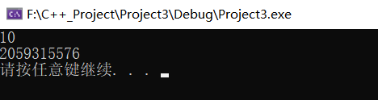


​	**堆区：**

​		由程序员分配释放,若程序员不释放,程序结束时由操作系统回收

​		在C++中主要利用**new**在堆区开辟内存

**示例：**

```c++
int* func()
{
	int* a = new int(10);
	return a;
}

int main() {

	int *p = func();

	cout << *p << endl;
	cout << *p << endl;
    
	system("pause");

	return 0;
}
```

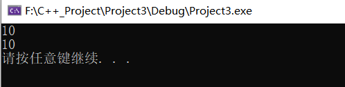

**总结：**

堆区数据由程序员管理开辟和释放

堆区数据利用new关键字进行开辟内存


### 1.3 new操作符


​	C++中利用==new：`new int(10);`==操作符在堆区开辟数据

​	手动释放利用操作符 ==delete：`delete p;`==

​	**语法：**` new 数据类型`

​	利用new创建的数据，会返回该数据==对应的类型的指针==


**示例1： 基本语法**

```c++
int* func()
{
	int* a = new int(10);
	return a;
}

int main() {

	int *p = func();

	cout << *p << endl;
	cout << *p << endl;

	//利用delete释放堆区数据
	delete p;

	//cout << *p << endl; //报错，释放的空间不可访问

	system("pause");

	return 0;
}
```


**示例2：开辟数组**

`int* arr = new int[10];` 		 `delete[] arr;`

```c++
//堆区开辟数组
int main() {

	int* arr = new int[10];

	for (int i = 0; i < 10; i++)
	{
		arr[i] = i + 100;
	}

	for (int i = 0; i < 10; i++)
	{
		cout << arr[i] << endl;
	}
	//释放数组 delete 后加 []
	delete[] arr;

	system("pause");

	return 0;
}

```


## 2 引用

### 2.1 引用的基本使用

**作用： **给变量起别名，相对于一块内存有两个变量可以操作这个内存空间；

**语法：** `数据类型 &别名 = 原名`  `int &b = a;`

**注意：**引用必须是合法的内存空间，也就是需要提前申请好的。不能直接对一个数据进行引用，他只能是一个别名，不能别人名字都没有

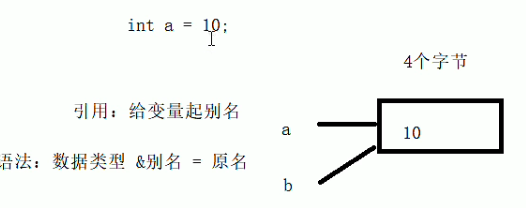

**示例：**

```C++
int main() {

	int a = 10;
	int &b = a;
   int& b = 10; // 错误，引用必须是合法的内存空间，也就是需要提前申请好的

	cout << "a = " << a << endl;
	cout << "b = " << b << endl;

	b = 100;

	cout << "a = " << a << endl;
	cout << "b = " << b << endl;

	system("pause");

	return 0;
}
```


### 2.2 引用注意事项

* **引用必须初始化**
* **引用在初始化后，不可以改变  **

示例：

```C++
int main() {

	int a = 10;
	int b = 20;
	//int &c; //错误，引用必须初始化
  
	int &c = a; //一旦初始化后，就不可以更改
	c = b; //这是赋值操作，不是更改引用

	cout << "a = " << a << endl;
	cout << "b = " << b << endl;
	cout << "c = " << c << endl;

	system("pause");

	return 0;
}
```


### 2.3 引用做函数参数

**作用：**函数传参时，可以利用引用的技术让==形参修饰实参==，即新的函数参数传递方式———引用传递

**优点：**可以简化指针修改实参


**示例：**

```C++
//1. 值传递
void mySwap01(int a, int b) {
	int temp = a;
	a = b;
	b = temp;
}

//2. 地址传递
void mySwap02(int* a, int* b) {
	int temp = *a;
	*a = *b;
	*b = temp;
}

//3. 引用传递
void mySwap03(int& a, int& b) {
	int temp = a;
	a = b;
	b = temp;
}

int main() {

	int a = 10;
	int b = 20;

	mySwap01(a, b);
	cout << "a:" << a << " b:" << b << endl;

	mySwap02(&a, &b);
	cout << "a:" << a << " b:" << b << endl;

	mySwap03(a, b);
	cout << "a:" << a << " b:" << b << endl;

	system("pause");

	return 0;
}

```

> 总结：通过引用参数产生的效果同按地址传递是一样的。引用的语法更清楚简单


### 2.4 引用做函数返回值


**作用：**==链式编程！！！==引用是可以作为函数的返回值存在的，**即返回内存空间的一个别名** （子函数里面这个内存空间是有名字的，就是那个局部变量，但这个局部变量在子函数结束了会被自动释放，相当于在释放前我们起了一个别名，指向这个内存空间了。)


**注意**：**不要返回局部变量引用，即return a；**，因为这块内存空间是编译器管理的，执行完了就释放了

**用法：**函数调用作为左值，即子函数我们获得一块内存空间，然后这个函数相当于返回了这个内存空间的别名，如a；


**示例：**

```C++
//返回局部变量引用
int& test01() {
	int a = 10; //局部变量
	return a;
}

//返回静态变量引用，
int& test02() {
	static int a = 20;  // 存放在全局区，在程序结束后系统释放
	return a;
}

int main() {

	//不能返回局部变量的引用
	int& ref = test01();
	cout << "ref = " << ref << endl; //  正确10
	cout << "ref = " << ref << endl;  // 错误-12671291

	
	int& ref2 = test02();
	cout << "ref2 = " << ref2 << endl;
	cout << "ref2 = " << ref2 << endl;
  
//  如果函数做左值，那么必须返回引用!!!!!!!没有见过！！！！！，
//  内存空间的别名赋值操作
	test02() = 1000;//

	cout << "ref2 = " << ref2 << endl;
	cout << "ref2 = " << ref2 << endl;

	system("pause");

	return 0;
}
```


​	


### 2.5 引用的本质

本质：**引用的本质在c++内部实现是一个指针常量.** 所以我们前面说引用初始化后不可更改！！

讲解示例：

```C++
//发现是引用，转换为 int* const ref = &a;
void func(int& ref){
	ref = 100; // ref是引用，转换为*ref = 100
}


int main(){
	int a = 10;
    
  //自动转换为 int* const ref = &a; 
  // 指针常量是指针指向不可改，也说明为什么引用不可更改
	int& ref = a; 
	ref = 20; //内部发现ref是引用，自动帮我们转换为: *ref = 20;
    
	cout << "a:" << a << endl;
	cout << "ref:" << ref << endl;
    
	func(a);
	return 0;
}
```

结论：==C++推荐用引用技术==，因为语法方便，引用本质是指针常量，但是所有的指针操作编译器都帮我们做了


### 2.6 常量引用

**解释：**在引用表达式前加一个 const 修饰。

**作用：**常量引用主要用来==修饰形参，防止误操作==

在函数形参列表中，可以加==const修饰形参==，防止形参改变实参


前面讲了引用就是指针常量，那我们在前面再加一个const——`就是const即修饰指针，又修饰常量`，后期无法改变指针的指向和内存空间。

**示例：**

`const int& ref = 10;——正确 `

```C++
//引用使用的场景，通常用来修饰形参
void showValue(const int& v) {
	//v += 10;
	cout << v << endl;
}

int main() {

	int& ref = 10;  // error 引用本身需要一个合法的内存空间，因此这行错误
    
	//加入const就可以了，编译器优化代码，int temp = 10; const int& ref = temp;
	const int& ref = 10;

	//ref = 100;  //加入const后不可以修改变量
	cout << ref << endl;

	//函数中利用常量引用防止误操作修改实参
	int a = 10;
	showValue(a);

	system("pause");

	return 0;
}
```


## 3 函数提高

### 3.1 函数默认参数


在C++中，函数的形参列表中的形参是可以有默认值的。

语法：` 返回值类型  函数名 （参数= 默认值）{}`


**示例：**

```C++
int func(int a, int b = 10, int c = 10) {
	return a + b + c;
}

//1. 如果某个位置参数有默认值，那么从这个位置往后，从左向右，必须都要有默认值
//2. 如果函数声明有默认值，函数实现的时候就不能有默认参数
int func2(int a = 10, int b = 10);

int func2(int a, int b) {
	return a + b;
}

int main() {

	cout << "ret = " << func(20, 20) << endl;
	cout << "ret = " << func(100) << endl;

	system("pause");

	return 0;
}
```


### 3.2 函数占位参数


C++中函数的形参列表里可以有占位参数，用来做占位，调用函数时必须填补该位置


**语法：** `返回值类型 函数名 (数据类型){}`


在现阶段函数的占位参数存在意义不大，但是后面的课程中会用到该技术


**示例：**

```C++
//函数占位参数 ，占位参数也可以有默认参数
void func(int a, int) {
	cout << "this is func" << endl;
}

void func(int a, int = 100) {
	cout << "this is func" << endl;
}

int main() {

	func(10,10); //占位参数必须填补

	system("pause");

	return 0;
}
```


### 3.3 函数重载

#### 3.3.1 函数重载概述


**作用：**函数名可以相同，提高复用性


**函数重载满足条件：**

* 同一个作用域下
* 函数名称相同
* 函数参数**类型不同**  或者 **个数不同** 或者 **顺序不同**


**注意:**  函数的返回值不可以作为函数重载的条件


**示例：**

```C++
//函数重载需要函数都在同一个作用域下
void func()
{
	cout << "func 的调用！" << endl;
}
void func(int a)
{
	cout << "func (int a) 的调用！" << endl;
}
void func(double a)
{
	cout << "func (double a)的调用！" << endl;
}
void func(int a ,double b)
{
	cout << "func (int a ,double b) 的调用！" << endl;
}
void func(double a ,int b)
{
	cout << "func (double a ,int b)的调用！" << endl;
}

//函数返回值不可以作为函数重载条件
//int func(double a, int b)
//{
//	cout << "func (double a ,int b)的调用！" << endl;
//}


int main() {

	func();
	func(10);
	func(3.14);
	func(10,3.14);
	func(3.14 , 10);
	
	system("pause");

	return 0;
}
```


#### 3.3.2 函数重载注意事项


* 引用作为重载条件
* 函数重载碰到函数默认参数


**示例：**

```C++
//函数重载注意事项
//1、引用作为重载条件

void func(int &a)
{
	cout << "func (int &a) 调用 " << endl;
}

void func(const int &a)
{
	cout << "func (const int &a) 调用 " << endl;
}


//2、函数重载碰到函数默认参数

void func2(int a, int b = 10)
{
	cout << "func2(int a, int b = 10) 调用" << endl;
}

void func2(int a)
{
	cout << "func2(int a) 调用" << endl;
}

int main() {
	
	int a = 10;
	func(a); //调用无const
	func(10);//调用有const


	//func2(10); //碰到默认参数产生歧义，需要避免

	system("pause");

	return 0;
}
```


## **4** 类和对象


C++面向对象的三大特性为：==封装、继承、多态==


C++认为==万事万物都皆为对象==，对象上有其属性和行为


**例如：**

​	人可以作为对象，属性有姓名、年龄、身高、体重...，行为有走、跑、跳、吃饭、唱歌...

​	车也可以作为对象，属性有轮胎、方向盘、车灯...,行为有载人、放音乐、放空调...

​	具有相同性质的==对象==，我们可以抽象称为==类==，人属于人类，车属于车类

### 4.1 封装

#### 4.1.1  封装的意义

封装是C++面向对象三大特性之一

封装的意义：

* 将属性和行为作为一个整体，表现生活中的事物
* 将属性和行为加以权限控制


**封装意义一：**

​	在设计类的时候，属性和行为写在一起，表现事物

**语法：** `class 类名{   访问权限： 属性  / 行为  };` 通过对象.属性（行为）进行访问


**示例1：**设计一个圆类，求圆的周长

**示例代码：**

```C++
//圆周率
const double PI = 3.14;

//1、封装的意义
//将属性和行为作为一个整体，用来表现生活中的事物

//封装一个圆类，求圆的周长
//class代表设计一个类，后面跟着的是类名
class Circle
{
public:  //访问权限  公共的权限

	//属性————变量
	int m_r;//半径

	//行为————函数
	//获取到圆的周长
	double calculateZC()
	{
		//2 * pi  * r
		//获取圆的周长
		return  2 * PI * m_r;
	}
};

int main() {

	//通过圆类，创建圆的对象
	// c1就是一个具体的圆
	Circle c1;
	c1.m_r = 10; //给圆对象的半径 进行赋值操作

	//2 * pi * 10 = = 62.8
	cout << "圆的周长为： " << c1.calculateZC() << endl;

	system("pause");

	return 0;
}
```

**示例2：**设计一个学生类，属性有姓名和学号，可以给姓名和学号赋值，可以显示学生的姓名和学号

**示例2代码：**

```C++
//学生类
class Student {
public:
	void setName(string name) {
		m_name = name;
	}
	void setID(int id) {
		m_id = id;
	}

	void showStudent() {
		cout << "name:" << m_name << " ID:" << m_id << endl;
	}
public:
	string m_name;
	int m_id;
};

int main() {

	Student stu;
	stu.setName("德玛西亚");
	stu.setID(250);
	stu.showStudent();

	system("pause");

	return 0;
}

```


**封装意义二：**

类在设计时，可以把属性和行为放在不同的权限下，加以控制

访问权限有三种：


1. public          公共权限  	类内可以访问  类外可以访问
2. protected   保护权限      类内可以访问  类外不可以访问 继承时子类可以访问
3. private        私有权限      类内可以访问  类外不可以访问 继承时子类也不可以访问


**示例：**

```C++
//三种权限
//公共权限  public     类内可以访问  类外可以访问
//保护权限  protected  类内可以访问  类外不可以访问 继承时子类可以访问
//私有权限  private    类内可以访问  类外不可以访问 继承时子类也不可以访问

class Person
{
	//姓名  公共权限
public:
	string m_Name;

	//汽车  保护权限
protected:
	string m_Car;

	//银行卡密码  私有权限
private:
	int m_Password;

public:
	void func()
	{
		m_Name = "张三";
		m_Car = "拖拉机";
		m_Password = 123456;
	}
};

int main() {

	Person p;
	p.m_Name = "李四";
	//p.m_Car = "奔驰";  //保护权限类外访问不到
	//p.m_Password = 123; //私有权限类外访问不到

	system("pause");

	return 0;
}
```


#### 4.1.2 struct和class区别


在C++中 struct和class唯一的**区别**就在于 **默认的访问权限不同**，都可以做类似的操作。

结构体：是用户==自定义的数据类型==。

**区别：**

* struct 默认权限为**公共**
* class   默认权限为**私有**


```C++
class C1
{
	int  m_A; //默认是私有权限
};

struct C2
{
	int m_A;  //默认是公共权限
};

int main() {

	C1 c1;
	c1.m_A = 10; //错误，访问权限是私有

	C2 c2;
	c2.m_A = 10; //正确，访问权限是公共

	system("pause");

	return 0;
}
```


#### 4.1.3 成员属性设置为私有


**优点1：**将所有成员属性设置为私有，可以自己控制读写权限

**优点2：**对于写权限，我们可以检测数据的有效性


**示例：**

```C++
class Person {
public:

	//姓名设置可读可写
	void setName(string name) {
		m_Name = name;
	}
	string getName()
	{
		return m_Name;
	}


	//获取年龄 
	int getAge() {
		return m_Age;
	}
	//设置年龄
	void setAge(int age) {
		if (age < 0 || age > 150) {
			cout << "你个老妖精!" << endl;
			return;
		}
		m_Age = age;
	}

	//情人设置为只写
	void setLover(string lover) {
		m_Lover = lover;
	}

private:
	string m_Name; //可读可写  姓名
	
	int m_Age; //只读  年龄

	string m_Lover; //只写  情人
};


int main() {

	Person p;
	//姓名设置
	p.setName("张三");
	cout << "姓名： " << p.getName() << endl;

	//年龄设置
	p.setAge(50);
	cout << "年龄： " << p.getAge() << endl;

	//情人设置
	p.setLover("苍井");
	//cout << "情人： " << p.m_Lover << endl;  //只写属性，不可以读取

	system("pause");

	return 0;
}
```


### 4.2 对象的初始化和清理


*  生活中我们买的电子产品都基本会有出厂设置，在某一天我们不用时候也会删除一些自己信息数据保证安全
*  C++中的面向对象来源于生活，每个对象也都会有初始设置以及 对象销毁前的清理数据的设置。


#### 4.2.1 构造函数和析构函数

对象的**初始化和清理**也是两个非常重要的安全问题：

​	一个对象或者变量没有初始状态，对其使用后果是未知

​	同样的使用完一个对象或变量，没有及时清理，也会造成一定的安全问题


c++利用了**构造函数**和**析构函数**解决上述问题，这两个函数将会被编译器自动调用，完成对象初始化和清理工作。

对象的初始化和清理工作是编译器强制要我们做的事情，因此如果**我们不提供构造和析构，编译器会提供**

**编译器提供的构造函数和析构函数是空实现。**


* **构造函数：**对象初始化。主要作用在于创建对象时为对象的成员属性赋值，构造函数由编译器自动调用，无须手动调用。
* **析构函数：**对象清理工作。主要作用在于对象**销毁前**系统自动调用，执行一些清理工作。


**构造函数语法：**`类名(){}`

1. 构造函数，没有返回值也不写void
2. 函数名称与类名相同
3. 构造函数可以有参数，因此可以发生重载
4. 程序在调用对象时候会自动调用构造，无须手动调用,而且只会调用一次


**析构函数语法：** `~类名(){}`

1. 析构函数，没有返回值也不写void
2. 函数名称与类名相同,在名称前加上符号  ~
3. 析构函数==不可以有参数==，因此不可以发生重载
4. 程序在对象销毁前会自动调用析构，无须手动调用,而且只会调用一次


```C++
class Person
{
public:
	//构造函数
	Person()
	{
		cout << "Person的构造函数调用" << endl;
	}
	//析构函数
	~Person()
	{
		cout << "Person的析构函数调用" << endl;
	}

};

void test01()
{
	Person p;
}

int main() {
	
	test01();

	system("pause");

	return 0;
}
```


#### 4.2.2 构造函数的分类及调用

##### 匿名对象

两种分类方式：

​	按参数分为： 有参构造和无参构造

​	按类型分为： 普通构造和拷贝构造（前面写的有参无参的都是普通构造函数）

​    也就是分为：**有参、无参、拷贝**三种

三种调用方式：

​	括号法————`Person p1(10);`     `Person p1;`

​	显示法————`Person p2 = Person(10);` 

​	隐式转换法————`Person p4 = 10;`

​    注意：调用无参构造函数不能加括号，如果加了编译器认为这是一个函数声明

**拷贝构造：**

​		就是把另一个对象拷贝过来，必须是==const修饰==，防止传递进来的对象被修改，而且必须是==引用的形式==接收

==**匿名对象：**==

​		创建对象时，直接这样写  `Person(10)`   单独写一行 就是创建一个匿名对象 当前行结束之后，马上析构。   注意：无法用拷贝构造函数初始化匿对象的，因为C++对这种写法会转换为： `Person(ppp);===>>> Person ppp;` 去创建一个ppp的对象，但这个ppp对象已经存在了，出现重定义错误！！！

**示例：**

```C++
//1、构造函数分类
// 按照参数分类分为 有参和无参构造   无参又称为默认构造函数
// 按照类型分类分为 普通构造和拷贝构造

class Person {
    
public:
	//1. 无参（默认）构造函数
	Person() {
		cout << "无参构造函数!" << endl;
	}
	//2. 有参构造函数
	Person(int a) {
		age = a;
		cout << "有参构造函数!" << endl;
	}
	//3. 拷贝构造函数
	Person(const Person& p) {
		age = p.age;
		cout << "拷贝构造函数!" << endl;
	}
	//析构函数
	~Person() {
		cout << "析构函数!" << endl;
	}
    
public:
	int age;
    
};

//2、构造函数的调用

//调用无参构造函数
void test01() {
	Person p; //调用无参构造函数
}

//调用有参的构造函数
void test02() {

	//括号法，常用
    //注意1：调用无参构造函数不能加括号，如果加了编译器认为这是一个函数声明
	Person p1(10);


	//2.2 显式法
    Person(10)   // Person(10)单独写一行 就是创建一个匿名对象 当前行结束之后，马上析构
	Person p2 = Person(10); 
	Person p3 = Person(p2);
	
	//2.3 隐式转换法
	Person p4 = 10; // Person p4 = Person(10); 

}

//调用拷贝构造函数
void test03(){
    // 现在有了这个对象
    Person ppp(199);
    // 我们调用拷贝构造函数去复制一个对象, pppcopy和ppp就一模一样
    Person pppcopy(ppp);
	  Person pppcopy2 = ppp; //拷贝构造  
  
    //但是注意了：下面这种写法就错了
    Person(ppp);
    // 看出来了，这是在初始化一个匿名对象，是无法用拷贝构造函数初始化匿对象的，因为C++对这种写法会转换为： Person(ppp);===>>> Person ppp; 去创建一个ppp的对象，但这个ppp对象已经存在了，出现重定义错误！！！
    
}

int main() {

	test01();
	//test02();

	system("pause");

	return 0;
}
```


#### 4.2.3 拷贝构造函数调用时机


C++中拷贝构造函数调用时机通常有三种情况

* 使用一个已经创建完毕的对象来初始化一个新对象（复制克隆）
* **值传递 的方式给函数参数传值**。也就是说我们值传递时，底层原理就是拷贝构造函数
* **以值方式返回局部对象**。子函数返回一个局部对象的时候，main获取接收这个对象底层时拷贝构造函数的使用


**示例：**

```C++
class Person {
public:
	Person() {
		cout << "无参构造函数!" << endl;
		mAge = 0;
	}
	Person(int age) {
		cout << "有参构造函数!" << endl;
		mAge = age;
	}
	Person(const Person& p) {
		cout << "拷贝构造函数!" << endl;
		mAge = p.mAge;
	}
	//析构函数在释放内存之前调用
	~Person() {
		cout << "析构函数!" << endl;
	}
public:
	int mAge;
};


//1. 使用一个已经创建完毕的对象来初始化一个新对象
void test01() {

	Person man(100); //p对象已经创建完毕
	Person newman(man); //调用拷贝构造函数
	Person newman2 = man; //拷贝构造

	//Person newman3;
	//newman3 = man; //不是调用拷贝构造函数，赋值操作
}

//2. 值传递的方式给函数参数传值
//相当于Person p1(p);
void doWork(Person p1) {}
void test02() {
	Person p; //无参构造函数
	doWork(p);
}

//3. 以值方式返回局部对象
Person doWork2()
{
	Person p1;
	cout << (int *)&p1 << endl;
	return p1;
}

void test03()
{
	Person p = doWork2();
	cout << (int *)&p << endl;
}


int main() {

	//test01();
	//test02();
	test03();

	system("pause");

	return 0;
}
```


#### 4.2.4 构造函数调用规则

默认情况下，c++编译器至少给一个类添加3个函数

1．默认构造函数(无参，函数体为空)

2．默认析构函数(无参，函数体为空)

3．默认拷贝构造函数，对属性进行值拷贝（浅拷贝操作）


**构造函数调用规则如下：**

* 如果用户定义有参构造函数，c++不在提供默认无参构造，但是会提供默认拷贝构造


* 如果用户定义拷贝构造函数，c++不会再提供其他构造函数


示例：

```C++
class Person {
public:
	//无参（默认）构造函数
	Person() {
		cout << "无参构造函数!" << endl;
	}
	//有参构造函数
	Person(int a) {
		age = a;
		cout << "有参构造函数!" << endl;
	}
	//拷贝构造函数
	Person(const Person& p) {
		age = p.age;
		cout << "拷贝构造函数!" << endl;
	}
	//析构函数
	~Person() {
		cout << "析构函数!" << endl;
	}
public:
	int age;
};

void test01()
{
	Person p1(18);
	//如果不写拷贝构造，编译器会自动添加拷贝构造，并且做浅拷贝操作
	Person p2(p1);

	cout << "p2的年龄为： " << p2.age << endl;
}

void test02()
{
	//如果用户提供有参构造，编译器不会提供默认构造，会提供拷贝构造
	Person p1; //此时如果用户自己没有提供默认构造，会出错
	Person p2(10); //用户提供的有参
	Person p3(p2); //此时如果用户没有提供拷贝构造，编译器会提供

	//如果用户提供拷贝构造，编译器不会提供其他构造函数
	Person p4; //此时如果用户自己没有提供默认构造，会出错
	Person p5(10); //此时如果用户自己没有提供有参，会出错
	Person p6(p5); //用户自己提供拷贝构造
}

int main() {

	test01();

	system("pause");

	return 0;
}
```


#### 4.2.5 深拷贝与浅拷贝


深浅拷贝是面试经典问题，也是常见的一个坑。


使用时机：当类的属性出现指针的时候。浅拷贝就不行了。


浅拷贝：简单的赋值拷贝操作，就是=赋值操作。


深拷贝：在**堆区**重新申请空间，进行拷贝操作。


**浅拷贝实例：**

  		就是之前写的类的属性没有指针的情况。

```c++
class Person {
public:
	//无参（默认）构造函数
	Person() {
		cout << "无参构造函数!" << endl;
	}
	//有参构造函数
	Person(int age ,int height) {
		
		cout << "有参构造函数!" << endl;
		m_age = age;
		m_height = new int(height);
		
	}
	//拷贝构造函数  
	Person(const Person& p) {
		cout << "拷贝构造函数!" << endl;
		m_age = p.m_age;
	}

	//析构函数
	~Person() {
		cout << "析构函数!" << endl;
	}
public:
	int m_age;
};


void test01()
{
	Person p1(18);

	Person p2(p1);

	cout << "p1的年龄： " << p1.m_age << " 身高： " << *p1.m_height << endl;

	cout << "p2的年龄： " << p2.m_age << " 身高： " << *p2.m_height << endl;
}

int main() {

	test01();

	system("pause");

	return 0;
}
```


**类的属性出现指针：**

当类的属性出现指针的时候，还用之前的浅拷贝会出现什么问题呢，看下面的代码

```C++
class Person {
public:
	int m_age;
	int* m_height;  // 1.出现指针属性了
  
public:
	//无参（默认）构造函数
	Person() {
		cout << "无参构造函数!" << endl;
	}
	//有参构造函数
	Person(int age ,int height) {
		
		cout << "有参构造函数!" << endl;
		m_age = age;
		m_height = new int(height); //2.在堆区开辟内存空间，注意要受到释放
		
	}
	//编译器默认提供 浅拷贝构造函数  

	//析构函数
	~Person() {
		cout << "析构函数!" << endl;
    // 3.堆区的内存空间必须释放，不然出大问题！
		if (m_height != NULL)
		{
			delete m_height;
		}
	}

};


void test01()
{
	Person p1(18, 180);

	Person p2(p1);

	cout << "p1的年龄： " << p1.m_age << " 身高： " << *p1.m_height << endl;

	cout << "p2的年龄： " << p2.m_age << " 身高： " << *p2.m_height << endl;
}

int main() {

	test01();

	system("pause");

	return 0;
}
```

**运行测试：报错**

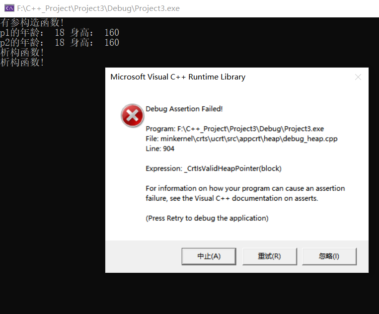

**原因在于：**

在浅拷贝的时候，他就只是很单纯的值赋值，如下：

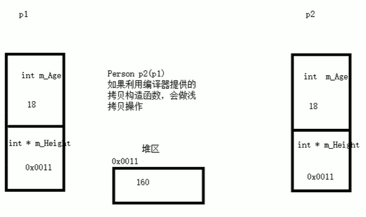

因为我们有一个对象属性是指针，所以说他存放的是堆区内存空间的地址，就会直接复制到p2对象里面去，好了，现在看似没有问题，一切正常《《《《

但是当我们对象被释放时出问题了，栈区是先进后出，p2先被释放，p2释放的时候执行析构函数，我们手动释放掉了`m_height`这个堆区内存空间。好了p2结束了，该p1释放了，他也执行析构函数，也去释放`m_height`这个堆区内存空间，报错！！！！！空间已经不存在了。

》》》这就是浅拷贝带来的堆区内存重复释放问题。

**解决问题：深拷贝**

》》》利用深拷贝解决，在堆区重新申请一块内存空间，把之前内存空间的值复制过来新的。两个对象的指针属性的地址不同，内存空间存的数据相同。

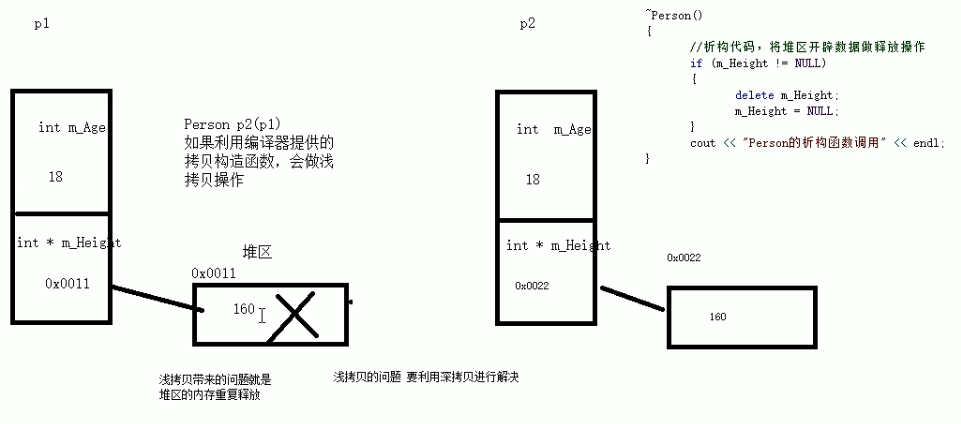

```c++
class Person {
public:
	int m_age;
	int* m_height;  // 1.出现指针属性了
  
public:
	//无参（默认）构造函数
	Person() {
		cout << "无参构造函数!" << endl;
	}
	//有参构造函数
	Person(int age ,int height) {
		
		cout << "有参构造函数!" << endl;
		m_age = age;
		m_height = new int(height); //2.在堆区开辟内存空间，注意要受到释放
		
	}
	//&&&4.自己写深拷贝构造函数
  Person(const Person& p){
    cout << "自己深拷贝构造函数!" << endl;
    m_age = p.m_age;
    // 深拷贝
    m_height = new int(*p.m_height)
    
  }
  
  

	//析构函数
	~Person() {
		cout << "析构函数!" << endl;
    // 3.堆区的内存空间必须释放，不然出大问题！
		if (m_height != NULL)
		{
			delete m_height;
		}
	}

};


void test01()
{
	Person p1(18, 180);

	Person p2(p1);

	cout << "p1的年龄： " << p1.m_age << " 身高： " << *p1.m_height << endl;

	cout << "p2的年龄： " << p2.m_age << " 身高： " << *p2.m_height << endl;
}

int main() {

	test01();

	system("pause");

	return 0;
}
```


#### 4.2.6 初始化列表


**作用：**

C++提供了初始化列表语法，用来初始化属性，比有参构造器简洁很多！！


**语法：**`构造函数()：属性1(值1),属性2（值2）... {}`

​			`Person(int a, int b, int c) :m_A(a), m_B(b), m_C(c) {}`


**示例：**

```C++
class Person {
public:

	////传统方式初始化
	Person(int a, int b, int c) {
		m_A = a;
		m_B = b;
		m_C = c;
	}

	//初始化列表方式初始化
	Person(int a, int b, int c) :m_A(a), m_B(b), m_C(c) {}
  
	void PrintPerson() {
		cout << "mA:" << m_A << endl;
		cout << "mB:" << m_B << endl;
		cout << "mC:" << m_C << endl;
	}
private:
	int m_A;
	int m_B;
	int m_C;
};

int main() {

	Person p(1, 2, 3);
	p.PrintPerson();


	system("pause");

	return 0;
}
```


#### 4.2.7 类对象作为类成员


C++类中的成员可以是另一个类的对象，我们称该成员为 **对象成员**


例如：

```C++
class A {}

class B
{
    A a；//类A的一个对象a
}
```

B类中有对象A作为成员，A为对象成员


那么当创建B对象时，A与B的构造和析构的顺序是谁先谁后？


**示例：**

```C++
class Phone
{
public:
	Phone(string name)
	{
		m_PhoneName = name;
		cout << "Phone构造" << endl;
	}

	~Phone()
	{
		cout << "Phone析构" << endl;
	}

	string m_PhoneName;

};


class Person
{
public:
  
	string m_Name;
	Phone m_Phone;
public:
	// 其中 m_Phone(pName)讲道理数据类型是不对的，但编译器帮我们做了一个隐式转换
  // m_Phone(pName)===>>> Phone m_Phone = pName;
	Person(string name, string pName) :m_Name(name), m_Phone(pName)
	{
		cout << "Person构造" << endl;
	}

	~Person()
	{
		cout << "Person析构" << endl;
	}


};
void test01()
{

	Person p("张三" , "苹果X");
	cout << p.m_Name << " 使用" << p.m_Phone.m_PhoneName << " 牌手机! " << endl;

}


int main() {

	test01();

	system("pause");

	return 0;
}
```

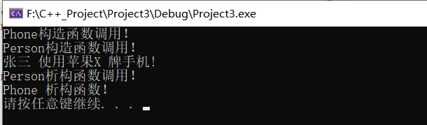

构造的顺序是 ：先调用对象成员的，再调用本类的（从里到外）

析构顺序与构造相反


#### 4.2.8 静态成员

**静态成员**就是在**成员变量**和**成员函数**前加上关键字static，称为静态成员

静态成员分为：


*  静态成员变量——类的东西
   *  所有对象共享同一份数据
   
   *  在编译阶段分配内存——全局区
   
   *  **必须只能类内声明，类外初始化**，他不能在类内赋值！！但所有的变量都需要初始化才行，所以他只能类外，其他变量都可以类内初始化。
   
      `int Person::m_A = 10;`
   
*  静态成员函数——类的东西
   *  所有对象共享同一个函数
   *  静态成员函数只能访问静态成员变量（静态的只能访问静态的）
   *  和普通成员函数一样，既可以类内初始化也可以类外


**示例1 ：**静态成员变量

访问方式：

1. 类内声明，类外初始化：	`int Person::m_A = 10;`
1. 通过对象访问：	`Person p1;	p1.m_A`
2. 通过类名访问：    `Person::m_A`

```C++
class Person
{
public:

	static int m_A; //静态成员变量

private:
	static int m_B; //私有静态成员变量也是类外初始化
};
// 类内声明，类外初始化
int Person::m_A = 10;
int Person::m_B = 10;

void test01()
{
	//静态成员变量两种访问方式

	//1、通过对象
	Person p1;
	p1.m_A = 100;
	cout << "p1.m_A = " << p1.m_A << endl;

	Person p2;
	p2.m_A = 200;
	cout << "p1.m_A = " << p1.m_A << endl; //共享同一份数据
	cout << "p2.m_A = " << p2.m_A << endl;

	//2、通过类名
	cout << "m_A = " << Person::m_A << endl;


	//cout << "m_B = " << Person::m_B << endl; //私有权限访问不到
}

int main() {

	test01();

	system("pause");

	return 0;
}
```


**示例2：**静态成员函数

访问方式：

1. 就和普通成员函数一样类内类外均可以初始化： 类外初始化：`Person::func2(){ }`
1. 通过对象访问：	`Person p1;		p1.func();`
2. 通过类名访问：    `Person::func();`

```C++
class Person
{
public:
	static int m_A; //静态成员变量
	int m_B; 
  
public:
	static void func()
	{
		cout << "static void func 调用" << endl;
		m_A = 100;
		m_B = 100; //错误，不可以访问非静态成员变量
	}

private:
	//私有静态成员函数也是y
	static void func2()
	{
		cout << "func2调用" << endl;
    m_A = 100;
	}
};
int Person::m_A = 10;


void test01()
{
	//静态成员变量两种访问方式

	//1、通过对象
	Person p1;
	p1.func();

	//2、通过类名
	Person::func();

	//Person::func2(); //私有权限访问不到
}


int main() {

	test01();

	system("pause");

	return 0;
}
```


### 4.3 C++对象模型和this指针


#### 4.3.1 成员变量和成员函数分开存储


在C++中，类内的**成员变量和成员函数分开存储;**

只有**非静态成员变量**====>>>才属于**类的对象**上;


**1、空对象的内存大小——1**

空对象占用内存空间为：1。C++编译器会给每个空对象分配一个字节的空间，目的是为了区分多个空对象在内存里面的位置,不然无法区分多个空对象，仅此而已。假如有一个int属性，那么对象大小就是4哦，C++就不会再多分一个字节的空间了，因为已经可以区分不同对象了。

```C++
class Person {

};
void test01() {
	Person p;
	cout << "size of p = " <<sizeof(p) << endl; //结果为1
	// 空对象占用内存空间为：1
	// C++编译器会给每个空对象分配一个字节的空间，目的是为了区分多个空对象
	// 在内存里面的位置,不然无法区分多个空对象，仅此而已
}

int main() {

	test01();


	system("pause");
	return 1;
}
```

**2、各种属性与对象的关系**

我们根据查看内存来看，各种成员变量成员函数与对象的关系。

成员变量和成员函数分开存储;

```c++
class Person {

	int m_A;			// 非静态成员变量	属于类的对象

	static int m_B;		// 静态成员变量  不属于类的对象

	void func() {};		// 非静态成员函数  不属于类的对象

	static void func2() {};  // 静态成员函数  不属于类的对象

};
int Person::m_B = 10;


void test02() {
	Person p;
	cout << "size of p = " << sizeof(p) << endl;  //===> 4
} 

int main() {

	test02();

	system("pause");
	return 1;
}
```

**可以看出：仅仅非静态成员变量才属于对象。**

疑问来了：为什么成员函数也不属于类呢，那我多个对象调用函数的时候，函数是怎么区分是哪个对象在调用呢？====》》》this指针的作用


#### 4.3.2 this指针概念

通过4.3.1我们知道在C++中成员变量和成员函数是分开存储的

**每一个非静态成员函数只会诞生一份函数实例，也就是说多个同类型的对象会共用一块代码**

那么问题是：这一块代码是如何区分那个对象调用自己的呢？


c++通过提供特殊的对象指针，this指针，解决上述问题。**this指针指向被调用的成员函数所属的对象**

> 方框就是成员函数，谁调用这个函数，函数的this指针就指向谁！！！

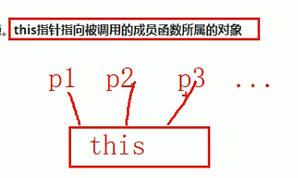

- this指针是隐含每一个非静态成员函数内的一种指针
- this指针不需要定义，直接使用即可
- this指针本质：**指针常量**，指针的执行不可以修改


**this指针的用途：**

*  **当形参和成员变量同名时**，可用this指针来区分

*  **在类的非静态成员函数中返回对象本身**，使用`return *this`，然后返回值为：`Person&`必须是引用形式。不引用返回的话，函数执行完结果返回的就是一个新的对象，就不是之前p2了

   因为this指向的是这个对象嘛，*this就是解引用，就可以获得p1对象了**（链式编程的时候必用）**

```C++
class Person {
public:
	int age;

	//1. 当形参和成员变量同名时，可用this指针来区分
	Person(int age) {
		// this指针指向被调用的成员函数所属的对象—p1
		this->age = age;
	}

	//2.在类的非静态成员函数中返回对象本身
	Person& PersonAdd(const Person& p) { 
		this->age += p.age;
		return *this;
	}
	//注意：返回值必须是引用哦
	//不引用返回的话，函数执行完结果返回的就是一个新的对象，就不是之前p2了
};


int main() {

	Person p1(10);// p对象在调用有参构造函数，所以里面的this指向p1
	cout << "p1.age = " << p1.age << endl;
	
	Person p2(10);
	p2.PersonAdd(p1).PersonAdd(p1);
	cout << "p2.age = " << p2.age << endl;

	system("pause");
	return 1;
}
```


#### 4.3.3 空指针访问成员函数


C++中空指针也是可以调用成员函数的，但是也要注意**有没有用到this指针**


如果用到this指针，需要加以判断保证代码的健壮性


**示例：**

```C++
//空指针访问成员函数
class Person {
public:

	void ShowClassName() {
		cout << "我是Person类!" << endl;
	}

	void ShowPerson() {
		if (this == NULL) {
			return;
		}
		cout << mAge << endl;
	}

public:
	int mAge;
};

void test01()
{
	Person * p = NULL;
	p->ShowClassName(); //空指针，可以调用成员函数
	p->ShowPerson();  //但是如果成员函数中用到了this指针，就不可以了
}

int main() {

	test01();

	system("pause");

	return 0;
}
```


#### 4.3.4 const修饰成员函数


**常函数：**

* 成员函数后加const后我们称为这个函数为常函数`void ShowPerson() const {}`

* 常函数内**不可以修改**成员属性

* 成员属性声明时加关键字**mutable**后，在常函数中依然**可以修改**

  

> this指针的本质是一个指针常量，指向对象，指针的指向不可修改；
>
> 在成员函数后加const，实际修饰的是this指针，让指针指向的值也不可修改。也就是成员变量。


**常对象：**

* 声明对象前加const称该对象为常对象  `const Person person;`
* 常对象===>>>>只能调用**常函数**
* 常对象===>>>>不能修改**成员变量**的值, 但是可以访问，可以改**mutable**


**示例：**

```C++
class Person {
public:
	Person() {
		m_A = 0;
		m_B = 0;
	}

	// this指针的本质是一个指针常量，指针的指向不可修改
	// 在成员函数后加const，实际修饰的是this指针，让指针指向的值也不可修改
	void ShowPerson() const {
        
		this = NULL; // 不能修改指针的指向 Person* const this;
		this->mA = 100; // 加了const后，this指针指向的对象的数据是不可以修改

		//但是const修饰成员函数，mutable修饰的成员变量可以修改
		this->m_B = 100;
	}

	void MyFunc() const {
		//mA = 10000;  不可修改
	}

public:
	int m_A;
	mutable int m_B; //可修改 可变的
};


void test01() {

	const Person person; //常量对象  
	cout << person.m_A << endl;
	person.mA = 100; //常对象不能修改成员变量的值,但是可以访问
	person.m_B = 100; //但是常对象可以修改mutable修饰成员变量

	//常对象访问成员函数
	person.MyFunc(); //常对象只能调用const的函数

}

int main() {

	test01();

	system("pause");

	return 0;
}
```


### 4.4 友元


生活中你的家有客厅(Public)，有你的卧室(Private)

客厅所有来的客人都可以进去，但是你的卧室是私有的，也就是说只有你能进去

但是呢，你也可以允许你的好闺蜜好基友进去。


在程序里，有些私有属性 也想让类外特殊的一些函数或者类进行访问，就需要用到友元的技术


**友元的目的就是让一个函数或者类 访问另一个类中私有成员**


友元的关键字为  ==friend==


友元的三种实现

* 全局函数做友元
* 类做友元
* 成员函数做友元


#### 4.4.1 全局函数做友元

> 类中：friend void goodGay(const Building& building);
>
> 全局函数：void goodGay(const Building& building) {}

```C++
//1. 
class Building
{
	//告诉编译器 goodGay全局函数 是 Building类的好朋友，可以访问类中的私有内容
	friend void goodGay(const Building& building);

public:

	Building()
	{
		this->m_SittingRoom = "客厅";
		this->m_BedRoom = "卧室";
	}


public:
	string m_SittingRoom; //客厅

private:
	string m_BedRoom; //卧室
};

//2. 全局函数做友元
void goodGay(const Building& building)// 引用接收或指针接收
{
	cout << "好基友全局函数访问：" <<building.m_SittingRoom<< endl;
	cout << "好基友全局函数访问：" << building.m_BedRoom << endl;
}


int main(){

	Building building;
	goodGay(building);

	system("pause");
	return 0;
}
```


#### 4.4.2 类做友元


> 类中的所有成员变量、函数都可以访问那个类的私有内容！
>
> friend class goodGay;

```C++
class Building; //提前声明类，不让编辑器报错

//1. 
class Building
{
	//告诉编译器 goodGay类是Building类的好朋友，可以访问到Building类中私有内容
	friend class goodGay;

public:
	Building()
	{
		this->m_SittingRoom = "客厅";
		this->m_BedRoom = "卧室";
	}

public:
	string m_SittingRoom; //客厅
private:
	string m_BedRoom;//卧室
};


//2. 类做友元
class goodGay
{
public:

	goodGay()
    {
		this->building = new Building; 
        //在堆内创建一个对象，返回对象的指针，并且调用了Building的构造函数
	}
	void visit(){
    	// 这里属于友元类的成员变量访问：类的私有内容。
		cout << "好基友正在访问" << building->m_SittingRoom << endl;
		cout << "好基友正在访问" << building->m_BedRoom << endl;
    }

private:
	Building *building;
};


int main(){

	goodGay gg;
	gg.visit();

	system("pause");
	return 0;
}
```


#### 4.4.3 成员函数做友元

> friend void goodGay::visit();
>

```C++

class Building;
class goodGay
{
public:

	goodGay();
	void visit(); //只让visit函数作为Building的好朋友，可以发访问Building中私有内容
	void visit2(); 

private:
	Building *building;
};


class Building
{
	//告诉编译器  goodGay类中的visit成员函数 是Building好朋友，可以访问私有内容
	friend void goodGay::visit();

public:
	Building();

public:
	string m_SittingRoom; //客厅
private:
	string m_BedRoom;//卧室
};

Building::Building()
{
	this->m_SittingRoom = "客厅";
	this->m_BedRoom = "卧室";
}

goodGay::goodGay()
{
	building = new Building;
}

void goodGay::visit()
{
	cout << "好基友正在访问" << building->m_SittingRoom << endl;
	cout << "好基友正在访问" << building->m_BedRoom << endl;
}

void goodGay::visit2()
{
	cout << "好基友正在访问" << building->m_SittingRoom << endl;
	//cout << "好基友正在访问" << building->m_BedRoom << endl;
}

void test01()
{
	goodGay  gg;
	gg.visit();

}

int main(){
    
	test01();

	system("pause");
	return 0;
}
```


### 4.5 运算符重载


运算符重载概念：对已有的运算符重新进行定义，赋予其另一种功能，以适应不同的数据类型。可以使用函数重载。


#### 4.5.1 加号运算符重载


**作用：**实现两个自定义数据类型相加的运算

1、成员函数实现+号重载：

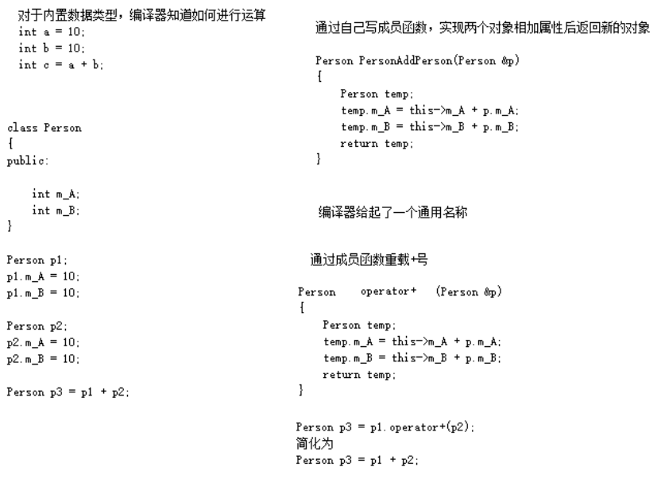

2、全局函数实现+重载：

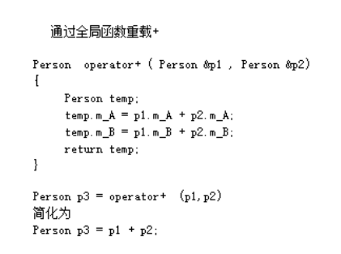

**注意：**上面两种对+号运算符重载的简化调用方式是一样的，也就是两个不能同时存在。只能留一个。

```C++
class Person {
public:
	Person() {};
	Person(int a, int b)
	{
		this->m_A = a;
		this->m_B = b;
	}
	//成员函数实现 + 号运算符重载
	Person operator+(const Person& p) {
		Person temp;
		temp.m_A = this->m_A + p.m_A;
		temp.m_B = this->m_B + p.m_B;
		return temp;
	}


public:
	int m_A;
	int m_B;
};

//全局函数实现 + 号运算符重载
//（这个和Person里面的重载函数只能留一个哦，因为他们的简化调用方式一模一样！！）
Person operator+(const Person& p1, const Person& p2) {
	Person temp(0, 0);
	temp.m_A = p1.m_A + p2.m_A;
	temp.m_B = p1.m_B + p2.m_B;
	return temp;
}

//运算符重载 可以发生函数重载 
Person operator+(const Person& p2, int val)  
{
	Person temp;
	temp.m_A = p2.m_A + val;
	temp.m_B = p2.m_B + val;
	return temp;
}

void test() {

	Person p1(10, 10);
	Person p2(20, 20);

	//成员函数方式
	Person p3 = p2 + p1;  //相当于 p2.operaor+(p1)；如果用的全局就是operaor+(p2,p1)
	cout << "mA:" << p3.m_A << " mB:" << p3.m_B << endl;

	//全局
	Person p4 = p3 + 10; //相当于 operator+(p3,10)
	cout << "mA:" << p4.m_A << " mB:" << p4.m_B << endl;

}

int main() {

	test();

	system("pause");

	return 0;
}
```


> 总结1：对于内置的数据类型的表达式的的运算符是不可能改变的

> 总结2：不要滥用运算符重载


#### 4.5.2 左移运算符重载


**作用：**可以输出自定义数据类型。指的是cout后面的<<这个运算符。这个只能通过==全局函数==实现！

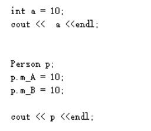

```c++
// 固定写法；cout是一个ostream对象，且只能有一个
// 一定要返回其引用值哦！！！！链式编程
ostream& operator<<(ostream& cout, Person& p) {
	cout << "a:" << p.m_A << " b:" << p.m_B;
	return cout;
}

// 然后，friend这种写法很好哦，这样输出的时候，不用调用set、get方法麻烦
friend ostream& operator<<(ostream& out, Person& p);
```

```C++
class Person {
    // 访问类的私有属性！！！
	friend ostream& operator<<(ostream& out, Person& p);

public:

	Person(int a, int b)
	{
		this->m_A = a;
		this->m_B = b;
	}

	//成员函数 实现不了  p << cout 不是我们想要的效果
    // 第一种：p1.operator<<(p2) 这样肯定不对
	void operator<<(Person& p){
	}
    //第二种：那我写一个cout给形参==>>>> p1.operator<<(cout) 简化：p<<cout 也不对啊cout在左边
    void operator<<(cout){
	}
    

private:
	int m_A;
	int m_B;
};

// 全局函数实现左移重载
// cout是一个ostream对象，且只能有一个，operator<<(cout,p) 简化：cout<<p
ostream& operator<<(ostream& cout, Person& p) {
	cout << "a:" << p.m_A << " b:" << p.m_B;
	return cout;
}


int main() {

	Person p1(10, 20);

	cout << p1 << "hello world" << endl; //链式编程！！！！！！！！！！！！！！！！

	system("pause");

	return 0;
}
```


> 总结：重载左移运算符配合友元可以实现输出自定义数据类型


#### 4.5.3 递增运算符重载


作用： 通过重载递增运算符，实现自己的**整型数据**

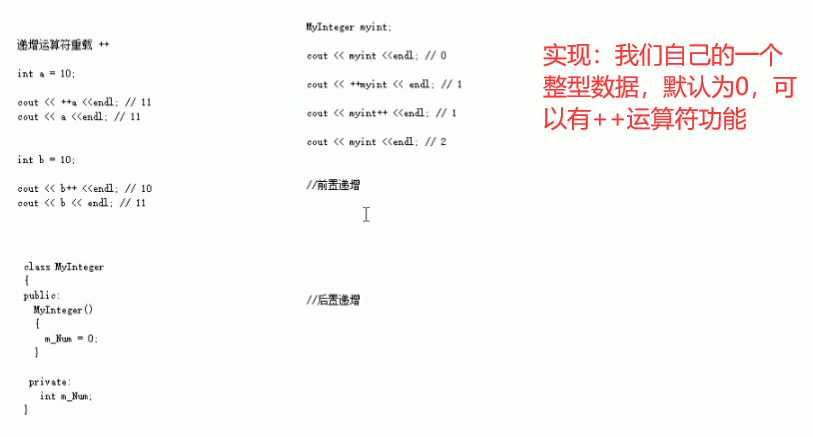

> 总结： 前置递增返回引用，后置递增返回值
>

```C++
class MyInteger {

	friend ostream& operator<<(ostream& out, MyInteger myint);

public:
	MyInteger() {
		m_Num = 0;
	}
	//前置++
	MyInteger& operator++() {
		m_Num++;
		return *this;
	}

	//后置++
	MyInteger operator++(int) {
        //建立了一个新对象记录当前本身的值，然后让本身的值加1，但是返回的是新对象，达到先返回后++；
		MyInteger temp = *this; 
		m_Num++;
		return temp;
	}

private:
	int m_Num;
};


ostream& operator<<(ostream& out, MyInteger myint) {
	out << myint.m_Num;
	return out;
}


//前置++ 先++ 再返回
void test01() {
	MyInteger myInt;
	cout << ++myInt << endl;
	cout << myInt << endl;
}

//后置++ 先返回 再++
void test02() {

	MyInteger myInt;
	cout << myInt++ << endl;
	cout << myInt << endl;
}

int main() {

	test01();
	//test02();

	system("pause");

	return 0;
}
```


#### 4.5.4 赋值运算符重载


**c++编译器至少给一个类添加4个函数：**

1. 默认构造函数(无参，函数体为空)
2. 默认析构函数(无参，函数体为空)
3. 默认拷贝构造函数，对属性进行值拷贝
4. 赋值运算符 operator=, 对属性进行值拷贝


如果类中有属性指向堆区，做赋值操作时也会出现深浅拷贝问题！！！同样是重复释放内存问题


**问题代码示例：**

```c++
class Person
{
public:
	//年龄的指针
	int* m_Age;

	Person(int age)
	{
		//将年龄数据开辟到堆区
		m_Age = new int(age);
	}

	~Person()
	{
		if (m_Age != NULL)
		{
			delete m_Age;
			m_Age = NULL;
		}
	}

};

void test01() {
	Person p1(18);
	Person p2(22);
	p2 = p1;
	cout << "p1的年龄为：" << *p1.m_Age << endl;
	cout << "p1的年龄为：" << *p2.m_Age << endl;
}

int main() {
	test01();


	system("pause");
	return 1;
}
```

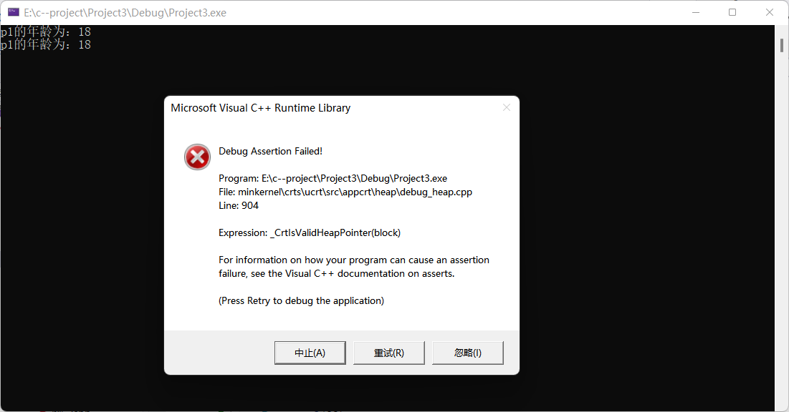

分析：浅拷贝只是简单赋值，出现两个指针指向同一个堆区内存的情况，堆区需要手动释放，则出现重复释放问题！！

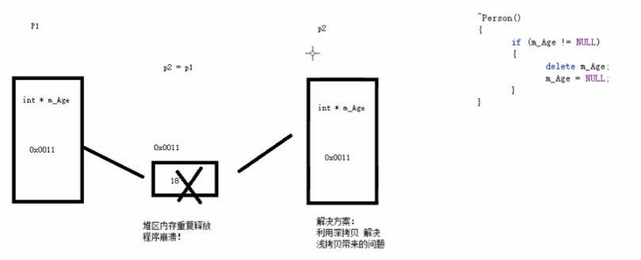


**完整代码示例：**

```C++
class Person
{
public:

	Person(int age)
	{
		//将年龄数据开辟到堆区
		m_Age = new int(age);
	}

	//重载赋值运算符 
	Person& operator=(Person& p) {
		// 1.应该先判断对象是否有属性在堆区，有的话先释放掉
		if (m_Age != NULL)
		{
			delete m_Age;
			m_Age = NULL;
		}
		//2. 深拷贝
		m_Age = new int(*p.m_Age);
		return *this;

	}


	~Person()
	{
		if (m_Age != NULL)
		{
			delete m_Age;
			m_Age = NULL;
		}
	}

	//年龄的指针
	int *m_Age;

};


void test01()
{
	Person p1(18);

	Person p2(20);

	Person p3(30);

	p3 = p2 = p1; //赋值操作

	cout << "p1的年龄为：" << *p1.m_Age << endl;

	cout << "p2的年龄为：" << *p2.m_Age << endl;

	cout << "p3的年龄为：" << *p3.m_Age << endl;
}

int main() {

	test01();


	system("pause");

	return 0;
}
```


#### 4.5.5 关系运算符重载


**作用：**重载关系运算符，可以让两个自定义类型对象进行对比操作。**==    !=**


**示例：**

```C++
class Person
{
public:
	Person(string name, int age)
	{
		this->m_Name = name;
		this->m_Age = age;
	};

	bool operator==(Person & p)
	{
		if (this->m_Name == p.m_Name && this->m_Age == p.m_Age)
		{
			return true;
		}
		else
		{
			return false;
		}
	}

	bool operator!=(Person & p)
	{
		if (this->m_Name == p.m_Name && this->m_Age == p.m_Age)
		{
			return false;
		}
		else
		{
			return true;
		}
	}

	string m_Name;
	int m_Age;
};

void test01()
{


	Person a("孙悟空", 18);
	Person b("孙悟空", 18);

	if (a == b)
	{
		cout << "a和b相等" << endl;
	}
	else
	{
		cout << "a和b不相等" << endl;
	}

	if (a != b)
	{
		cout << "a和b不相等" << endl;
	}
	else
	{
		cout << "a和b相等" << endl;
	}
}


int main() {

	test01();

	system("pause");

	return 0;
}
```


#### 4.5.6 函数调用运算符重载


* 函数调用运算符 **( )**  也可以重载
* 由于重载后使用的方式非常像函数的调用，因此称为**仿函数**
* 仿函数没有固定写法，非常灵活


**示例：**

```C++
class MyPrint
{
public:
	void operator()(string text)
	{
		cout << text << endl;
	}

};
void test01()
{
	//重载的（）操作符 也称为仿函数
	MyPrint myFunc;
	myFunc("hello world");
}


class MyAdd
{
public:
	int operator()(int v1, int v2)
	{
		return v1 + v2;
	}
};

void test02()
{
	MyAdd add;
	int ret = add(10, 10);
	cout << "ret = " << ret << endl;

	//匿名对象调用  
	cout << "MyAdd()(100,100) = " << MyAdd()(100, 100) << endl;
}

int main() {

	test01();
	test02();

	system("pause");

	return 0;
}
```


### 4.6  继承

**继承是面向对象三大特性之一**

有些类与类之间存在特殊的关系，例如下图中：


我们发现，定义这些类时，下级别的成员除了拥有上一级的共性，还有自己的特性。

这个时候我们就可以考虑利用继承的技术，减少重复代码


#### 4.6.1 继承的简介


例如我们看到很多网站中，都有公共的头部，公共的底部，甚至公共的左侧列表，只有中心内容不同

接下来我们分别利用普通写法和继承的写法来实现网页中的内容，看一下继承存在的意义以及好处


**普通实现：**

```C++
//Java页面
class Java 
{
public:
	void header()
	{
		cout << "首页、公开课、登录、注册...（公共头部）" << endl;
	}
	void footer()
	{
		cout << "帮助中心、交流合作、站内地图...(公共底部)" << endl;
	}
	void left()
	{
		cout << "Java,Python,C++...(公共分类列表)" << endl;
	}
	void content()
	{
		cout << "JAVA学科视频" << endl;
	}
};
//Python页面
class Python
{
public:
	void header()
	{
		cout << "首页、公开课、登录、注册...（公共头部）" << endl;
	}
	void footer()
	{
		cout << "帮助中心、交流合作、站内地图...(公共底部)" << endl;
	}
	void left()
	{
		cout << "Java,Python,C++...(公共分类列表)" << endl;
	}
	void content()
	{
		cout << "Python学科视频" << endl;
	}
};
//C++页面
class CPP 
{
public:
	void header()
	{
		cout << "首页、公开课、登录、注册...（公共头部）" << endl;
	}
	void footer()
	{
		cout << "帮助中心、交流合作、站内地图...(公共底部)" << endl;
	}
	void left()
	{
		cout << "Java,Python,C++...(公共分类列表)" << endl;
	}
	void content()
	{
		cout << "C++学科视频" << endl;
	}
};

void test01()
{
	//Java页面
	cout << "Java下载视频页面如下： " << endl;
	Java ja;
	ja.header();
	ja.footer();
	ja.left();
	ja.content();
	cout << "--------------------" << endl;

	//Python页面
	cout << "Python下载视频页面如下： " << endl;
	Python py;
	py.header();
	py.footer();
	py.left();
	py.content();
	cout << "--------------------" << endl;

	//C++页面
	cout << "C++下载视频页面如下： " << endl;
	CPP cp;
	cp.header();
	cp.footer();
	cp.left();
	cp.content();

}

int main() {

	test01();

	system("pause");

	return 0;
}
```


**继承实现：**

```C++
//公共页面
class BasePage
{
public:
	void header()
	{
		cout << "首页、公开课、登录、注册...（公共头部）" << endl;
	}

	void footer()
	{
		cout << "帮助中心、交流合作、站内地图...(公共底部)" << endl;
	}
	void left()
	{
		cout << "Java,Python,C++...(公共分类列表)" << endl;
	}

};

//Java页面
class Java : public BasePage
{
public:
	void content()
	{
		cout << "JAVA学科视频" << endl;
	}
};
//Python页面
class Python : public BasePage
{
public:
	void content()
	{
		cout << "Python学科视频" << endl;
	}
};
//C++页面
class CPP : public BasePage
{
public:
	void content()
	{
		cout << "C++学科视频" << endl;
	}
};

void test01()
{
	//Java页面
	cout << "Java下载视频页面如下： " << endl;
	Java ja;
	ja.header();
	ja.footer();
	ja.left();
	ja.content();
	cout << "--------------------" << endl;

	//Python页面
	cout << "Python下载视频页面如下： " << endl;
	Python py;
	py.header();
	py.footer();
	py.left();
	py.content();
	cout << "--------------------" << endl;

	//C++页面
	cout << "C++下载视频页面如下： " << endl;
	CPP cp;
	cp.header();
	cp.footer();
	cp.left();
	cp.content();


}

int main() {

	test01();

	system("pause");

	return 0;
}
```


**总结：**

继承的好处：==可以减少重复的代码==

class A : public B; 

A 类称为子类 或 派生类

B 类称为父类 或 基类


**派生类中的成员，包含两大部分**：

一类是从基类继承过来的，一类是自己增加的成员。

从基类继承过过来的表现其共性，而新增的成员体现了其个性。


#### 4.6.2 继承方式


继承的语法：`class 子类 : 继承方式  父类`，只继承public和protect成员


**继承方式一共有三种：**

* 公共继承	  `class B: public A`	将父类的public和protect成员按照原来的格式继承过来
* 保护继承      `class B: protected A`   将父类的public和protect成员全拿过来变成protected属性
* 私有继承      `class B: private A`  将父类的public和protect成员全部拿过来变成private属性


**示例：**

```C++
class Base1
{
public: 
	int m_A;
protected:
	int m_B;
private:
	int m_C;
};

//公共继承
class Son1 :public Base1
{
public:
	void func()
	{
		m_A; //可访问 public权限
		m_B; //可访问 protected权限
		//m_C; //不可访问
	}
};

void myClass()
{
	Son1 s1;
	s1.m_A; //其他类只能访问到公共权限
}

//保护继承
class Base2
{
public:
	int m_A;
protected:
	int m_B;
private:
	int m_C;
};
class Son2:protected Base2
{
public:
	void func()
	{
		m_A; //可访问 protected权限
		m_B; //可访问 protected权限
		//m_C; //不可访问
	}
};
void myClass2()
{
	Son2 s;
	//s.m_A; //不可访问
}

//私有继承
class Base3
{
public:
	int m_A;
protected:
	int m_B;
private:
	int m_C;
};
class Son3:private Base3
{
public:
	void func()
	{
		m_A; //可访问 private权限
		m_B; //可访问 private权限
		//m_C; //不可访问
	}
};
class GrandSon3 :public Son3
{
public:
	void func()
	{
		//Son3是私有继承，所以继承Son3的属性在GrandSon3中都无法访问到
		//m_A;
		//m_B;
		//m_C;
	}
};
```


#### 4.6.3 继承中的对象模型


**问题：**从父类继承过来的成员，哪些属于子类对象中？


> 结论1： 父类中私有成员也是被子类继承下去了，只是由编译器给隐藏后访问不到
>
> 结论2：父类中所有的非静态成员属性都会被子类继承下去
>
> 

**有争议的点：**子类是否继承了父类的静态成员？

​	答案是：没有！是共享关系！

​	前面说了静态成员是属于这个类自己的，是独特的东西，但是子类可以直接使用父类的静态成员，对象也可以直接用类的静态成员，但不要这么搞哦。


**示例：**

```C++
class Base
{
public:
	int m_A;
protected:
	int m_B;
private:
	int m_C; //私有成员只是被隐藏了，但是还是会继承下去
};

//公共继承
class Son :public Base
{
public:
	int m_D;
};

void test01()
{
	cout << "sizeof Son = " << sizeof(Son) << endl;
}

int main() {

	test01();

	system("pause");

	return 0;
}
```

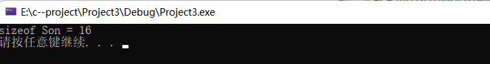


利用工具查看：


打开工具窗口后，定位到当前CPP文件的盘符 

 ```
 cd E:\c--project\Project3\Project3
 ```

然后输入： cl /d1 reportSingleClassLayout查看的类名   所属文件名

```
cl /d1 reportSingleClassLayoutSon 继承.cpp
```


效果如下图：

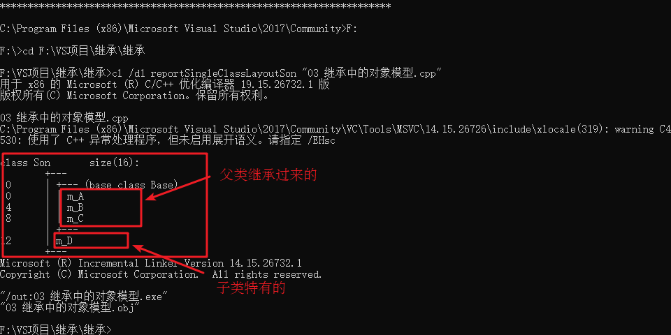


> 结论： 父类中私有成员也是被子类继承下去了，只是由编译器给隐藏后访问不到


#### 4.6.4 继承中构造和析构顺序


子类继承父类后，当创建子类对象，也会调用父类的构造函数


**问题：**父类和子类的构造和析构顺序是谁先谁后？


**结论：**继承中 先调用父类无参构造函数，再调用子类构造函数，析构顺序与构造相反。

原因在于：父类有些对象属性需要初始化操作！！~所以先调用父类的构造函数


> - 子类中所有的构造器默认都会先访问父类中**无参构造器**，再执行自己。
> - 为什么？
>       子类在初始化的时候，有可能会使用到父类中的数据，如果父类没有完成初始化，子类将无法使用父类的数据。
>       **子类初始化之前，一定要调用父类构造器先完成父类数据空间的初始化。**
>
> 子类构造器的第一行语句默认都是：**super( )**，不写也存在。
>
> 当子类想要调用父类的**有参构造器**时，直接用super.(.....)就行，作用是可以初始化继承过来的父类数据。


**示例：**

```C++
class Base 
{
public:
	Base()
	{
		cout << "Base构造函数!" << endl;
	}
	~Base()
	{
		cout << "Base析构函数!" << endl;
	}
};

class Son : public Base
{
public:
	Son()
	{
		cout << "Son构造函数!" << endl;
	}
	~Son()
	{
		cout << "Son析构函数!" << endl;
	}

};


void test01()
{
	//继承中 先调用父类构造函数，再调用子类构造函数，析构顺序与构造相反
	Son s;
}

int main() {

	test01();

	system("pause");

	return 0;
}
```


> 总结：继承中 先调用父类构造函数，再调用子类构造函数，析构顺序与构造相反


#### 4.6.5 继承同名成员处理方式


问题：当子类与父类出现同名的成员，如何通过**子类对象**，访问到子类或父类中同名的数据呢？


* 对象访问子类同名成员   直接访问即可	`Son s;   s.func();`
* 对象访问父类同名成员   需要加作用域     `s.Base::func();`
* 当子类与父类拥有同名的成员函数，子类会隐藏父类中同名成员函数，加作用域可以访问到父类中同名函数


**示例：**

```C++
class Base {
public:
	Base()
	{
		m_A = 100;
	}

	void func()
	{
		cout << "Base - func()调用" << endl;
	}

	void func(int a)
	{
		cout << "Base - func(int a)调用" << endl;
	}

public:
	int m_A;
};


class Son : public Base {
public:
	Son()
	{
		m_A = 200;
	}

	//当子类与父类拥有同名的成员函数，子类会隐藏父类中所有版本的同名成员函数
	//如果想访问父类中被隐藏的同名成员函数，需要加父类的作用域
	void func()
	{
		cout << "Son - func()调用" << endl;
	}
public:
	int m_A;
};

void test01()
{
	Son s;

	cout << "Son下的m_A = " << s.m_A << endl;
	cout << "Base下的m_A = " << s.Base::m_A << endl;

	s.func();
	s.Base::func();
	s.Base::func(10);

}
int main() {

	test01();

	system("pause");
	return EXIT_SUCCESS;
}
```

总结：

1. 子类对象可以直接访问到子类中同名成员
2. 子类对象加作用域可以访问到父类同名成员
3. 当子类与父类拥有同名的成员函数，子类会隐藏父类中同名成员函数，加作用域可以访问到父类中同名函数


#### 4.6.6 继承同名静态成员处理方式


问题：继承中同名的静态成员在**子类对象**上如何进行访问？


和上一节的非静态成员访问方式一模一样，但**多一种访问方式，通过类名的方式。**


- 访问子类同名成员   直接访问即可	`Son s;   s.func();`	`Son::m_A`
- 访问父类同名成员   需要加作用域       `s.Base::func();`       `Son::Base::m_A`   第一个冒号：：代表通过类名方式访问	第二个冒号：：代表访问父类作用域下的


注意：静态的成员不会被继承哦，子类父类是共享关系


**示例：**

```C++
class Base {
public:
	static void func()
	{
		cout << "Base - static void func()" << endl;
	}
	static void func(int a)
	{
		cout << "Base - static void func(int a)" << endl;
	}

	static int m_A;
};
int Base::m_A = 100;


class Son : public Base {
public:
	static void func()
	{
		cout << "Son - static void func()" << endl;
	}
	static int m_A;
};
int Son::m_A = 200;


//同名成员属性
void test01()
{
	//通过对象访问
	cout << "通过对象访问： " << endl;
	Son s;
	cout << "Son  下 m_A = " << s.m_A << endl;
	cout << "Base 下 m_A = " << s.Base::m_A << endl;

	//通过类名访问
	cout << "通过类名访问： " << endl;
	cout << "Son  下 m_A = " << Son::m_A << endl;
   	// 第一个冒号：：代表通过类名方式访问	第二个冒号：：代表访问父类作用域下的
	cout << "Base 下 m_A = " << Son::Base::m_A << endl;
}

//同名成员函数
void test02()
{
	//通过对象访问
	cout << "通过对象访问： " << endl;
	Son s;
	s.func();
	s.Base::func();

	cout << "通过类名访问： " << endl;
	Son::func();
	Son::Base::func();
	//出现同名，子类会隐藏掉父类中所有同名成员函数，需要加作作用域访问
	Son::Base::func(100);
}
int main() {

	//test01();
	test02();

	system("pause");

	return 0;
}
```

> 总结：同名静态成员处理方式和非静态处理方式一样，只不过有两种访问的方式（通过对象 和 通过类名）


#### 4.6.7 多继承语法


C++允许**一个类继承多个类**


语法：` class 子类 ：继承方式 父类1 ， 继承方式 父类2...`

​			`class Son : public Base2, public Base1 `


多继承可能会引发父类中有同名成员出现，需要加作用域区分


**C++实际开发中不建议用多继承**


**示例：**

```C++
class Base1 {
public:
	Base1()
	{
		m_A = 100;
	}
public:
	int m_A;
};

class Base2 {
public:
	Base2()
	{
		m_A = 200;  //开始是m_B 不会出问题，但是改为mA就会出现不明确
	}
public:
	int m_A;
};

//语法：class 子类：继承方式 父类1 ，继承方式 父类2 
class Son : public Base2, public Base1 
{
public:
	Son()
	{
		m_C = 300;
		m_D = 400;
	}
public:
	int m_C;
	int m_D;
};


//多继承容易产生成员同名的情况
//通过使用类名作用域可以区分调用哪一个基类的成员
void test01()
{
	Son s;
	cout << "sizeof Son = " << sizeof(s) << endl;
	cout << s.Base1::m_A << endl;
	cout << s.Base2::m_A << endl;
}

int main() {

	test01();

	system("pause");

	return 0;
}
```


> 总结： 多继承中如果父类中出现了同名情况，子类使用时候要加作用域


#### 4.6.8 菱形继承


**菱形继承概念：**

​	两个派生类继承同一个基类

​	又有某个类同时继承者两个派生类

​	这种继承被称为菱形继承，或者钻石继承


**典型的菱形继承案例：**


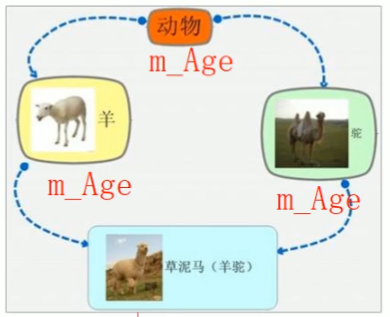


**菱形继承问题：**


1.    羊继承了动物的数据，驼同样继承了动物的数据，当草泥马使用数据时，就会产生二义性。

      ​	这个可以通过指定作用域解决。

2. 草泥马继承自动物的数据继承了两份，其实我们应该清楚，这份数据我们只需要一份就可以。

   ​	解决办法：**虚继承**

   

> 继承前加virtual关键字后，变为虚继承
>
> 此时最上面的公共的父类Animal称为虚基类


**示例：**

```C++
class Animal
{
public:
	int m_Age;
};

//继承前加virtual关键字后，变为虚继承
//此时公共的父类Animal称为虚基类
class Sheep : virtual public Animal {};
class Tuo   : virtual public Animal {};
class SheepTuo : public Sheep, public Tuo {};

void test01()
{
	SheepTuo st;
	st.Sheep::m_Age = 100;
	st.Tuo::m_Age = 200;

	cout << "st.Sheep::m_Age = " << st.Sheep::m_Age << endl;
	cout << "st.Tuo::m_Age = " <<  st.Tuo::m_Age << endl;
	cout << "st.m_Age = " << st.m_Age << endl;
}


int main() {

	test01();

	system("pause");

	return 0;
}
```

不加上virtual，虚继承时：

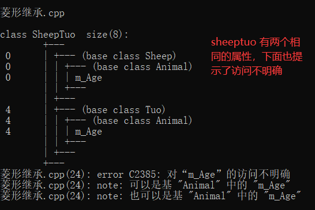

**加上virtual时：**原理如下

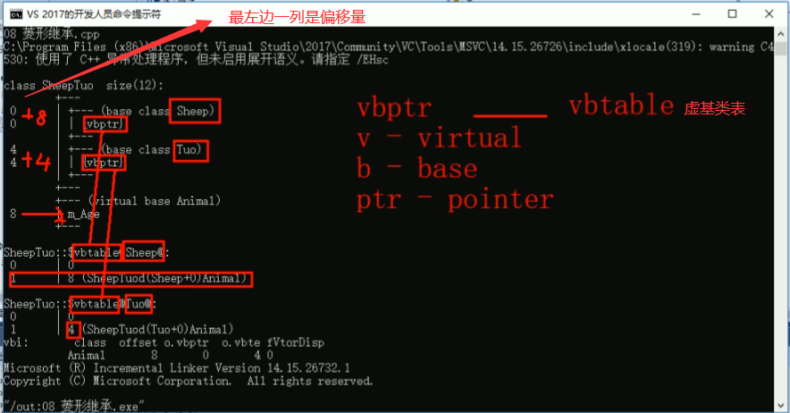


总结：

* 菱形继承带来的主要问题是子类继承两份相同的数据，导致资源浪费以及毫无意义
* 利用虚继承可以解决菱形继承问题


### 4.7  多态

#### 4.7.1 多态的基本概念


**先回顾一下java的多态**：

> - **多态的定义：**
>
>   ​		同类型的对象，执行同一个行为，会表现出不同的行为特征。有点难理解啊！！！
>
> - **注意：**
>
> ​				多态这种情况只针对**有继承/实现**关系的。**一定有方法重写**。
>
> ​				并不是说，抽象类/接口创建对象了啊！！！这没有创建对象，new的是子类/实现类的对象啊，很容易出问题，千万注意了。
>
> - **使用形式**：将**子类/实现类**的对象地址 赋给**父类/接口**，来让父类/接口表现出不同的行为。
>
>   ```java
>   父类类型   对象名称 = new  子类构造器;
>     接口    对象名称 = new  实现类构造器;
>   ```
>
> - **成员访问规则**
>
>   成员方法：取子类/实现类里面的 重写的成员方法；
>
>   成员变量：只看父类/接口
>
>   其实很好理解，多态的目的就是想让一个类型的对象可以表现出不同的行为，它只注重行为撒，就是将子类或实现类的行为给父类罢了，但父类里面一定要有这个行为，不然你给谁呢，对吧
>
>  **好处：**
>
> - 在多态形式下，右边对象可以实现解耦合，便于扩展和维护。
>
> ```java
> Animal a = new Dog();
> a.run(); // 后续业务行为随对象而变，后续代码无需修改
> ```
>
> - 定义方法的时候，使用父类型作为参数，该方法就可以接收这父类的一切子类对象，体现出多态的扩展性与便利。
>
> **多态下会产生的一个问题:**
>
> - 多态下不能使用子类的独有功能


**多态是C++面向对象三大特性之一**

多态分为两类

* 静态多态:  函数重载 和 运算符重载属于静态多态，就是复用函数名
* 动态多态:  派生类和虚函数实现运行时多态（重点）


静态多态和动态多态区别：

* 静态多态的函数地址早绑定  -  编译阶段确定函数地址
* 动态多态的函数地址晚绑定  -  运行阶段确定函数地址


**多态满足条件：** 

​	1、有继承关系

​	2、子类重写父类中的虚函数

**多态使用：**

​	父类指针或引用指向子类对象。`Animal& animal = Cat cat；`


**下面通过案例进行讲解多态：**

**1、错误写法。**

我们本意是传猫对象就执行猫说话的行为，狗对象就执行狗说话的行为。原因是：地址早绑定了，这种写法在编译阶段就确定了函数的地址

```c++
class Animal {
public:
	void speak() {
		cout << "动物在说话" << endl;
	}
};

class Cat : public Animal {
public:
	void speak() {
		cout << "猫在说话" << endl;
	}
};

// 执行说话的函数
// 地址早绑定了，这种写法在编译阶段就确定了函数的地址
void doSpeak(Animal& animal) { // Animal& animal = cat;
	animal.speak();
}

void test01() {
	Cat cat;
	doSpeak(cat);
}

int main() {
	test01();


	system("pause");
	return 1;
}
```


**2、正确的多态写法**

在多态的函数前面加上virtual关键字，变成虚函数，那么编译器在编译的时候就不能确定函数调用了。

```C++
class Animal
{
public:
	//Speak函数就是虚函数
	//函数前面加上virtual关键字，变成虚函数，那么编译器在编译的时候就不能确定函数调用了。
	virtual void speak()
	{
		cout << "动物在说话" << endl;
	}
};

class Cat :public Animal
{
public:
	void speak()
	{
		cout << "小猫在说话" << endl;
	}
};

class Dog :public Animal
{
public:

	void speak()
	{
		cout << "小狗在说话" << endl;
	}

};


void DoSpeak(Animal & animal)
{
	animal.speak();
}


void test01()
{
	Cat cat;
	DoSpeak(cat);

	Dog dog;
	DoSpeak(dog);
}


int main() {

	test01();

	system("pause");

	return 0;
}
```


##### 多态的底层原理

**1、先看一下内存情况**


分析：多一个4字节的内存，有可能是整型，float，指针，其实答案是指针——虚函数指针！！


**2、分析底层的内存原理**

 仅仅继承Animal类，不重写虚函数，就是直接全部拿过来给子类撒。

虚函数表记录虚函数的地址为  `&Animal::speak`

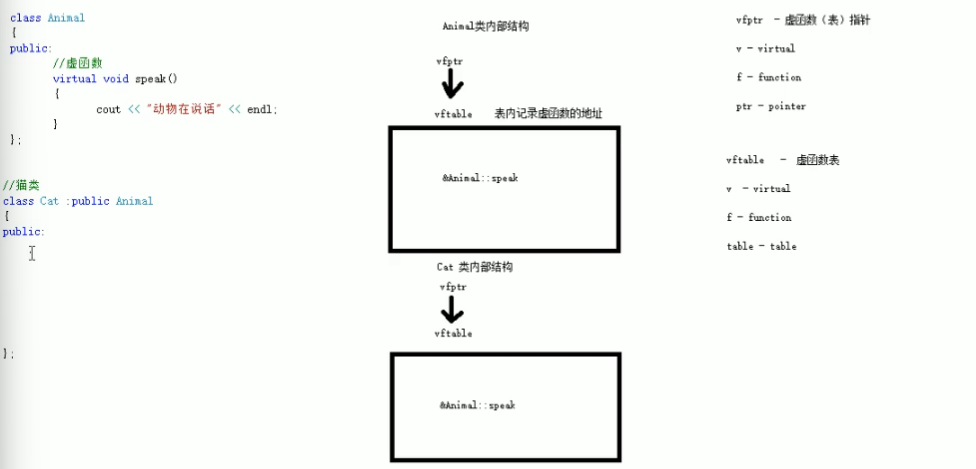

发生重写的时候，子类会把子类的虚函数表进行替换操作，换成子类虚函数的地址！！

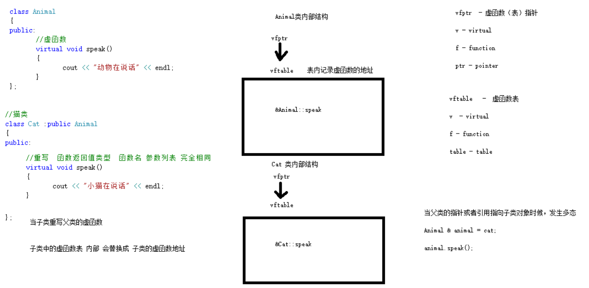

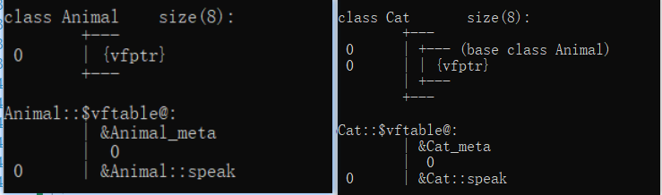


#### 4.7.2 多态案例一-计算器类


案例描述：

分别利用普通写法和多态技术，设计实现两个操作数进行运算的计算器类


多态的优点：

* 代码组织结构清晰
* 可读性强
* 利于前期和后期的扩展以及维护


**示例：**

```C++
//普通实现
class Calculator {
public:
	int getResult(string oper)
	{
		if (oper == "+") {
			return m_Num1 + m_Num2;
		}
		else if (oper == "-") {
			return m_Num1 - m_Num2;
		}
		else if (oper == "*") {
			return m_Num1 * m_Num2;
		}
		//如果要提供新的运算，需要修改源码
	}
public:
	int m_Num1;
	int m_Num2;
};

void test01()
{
	//普通实现测试
	Calculator c;
	c.m_Num1 = 10;
	c.m_Num2 = 10;
	cout << c.m_Num1 << " + " << c.m_Num2 << " = " << c.getResult("+") << endl;

	cout << c.m_Num1 << " - " << c.m_Num2 << " = " << c.getResult("-") << endl;

	cout << c.m_Num1 << " * " << c.m_Num2 << " = " << c.getResult("*") << endl;
}


//多态实现
//抽象计算器类
//多态优点：代码组织结构清晰，可读性强，利于前期和后期的扩展以及维护
class AbstractCalculator
{
public :

	virtual int getResult()
	{
		return 0;
	}

	int m_Num1;
	int m_Num2;
};

//加法计算器
class AddCalculator :public AbstractCalculator
{
public:
	int getResult()
	{
		return m_Num1 + m_Num2;
	}
};

//减法计算器
class SubCalculator :public AbstractCalculator
{
public:
	int getResult()
	{
		return m_Num1 - m_Num2;
	}
};

//乘法计算器
class MulCalculator :public AbstractCalculator
{
public:
	int getResult()
	{
		return m_Num1 * m_Num2;
	}
};


void test02()
{
	//创建加法计算器
	AbstractCalculator *abc = new AddCalculator;
	abc->m_Num1 = 10;
	abc->m_Num2 = 10;
	cout << abc->m_Num1 << " + " << abc->m_Num2 << " = " << abc->getResult() << endl;
	delete abc;  //用完了记得销毁

	//创建减法计算器
	abc = new SubCalculator;
	abc->m_Num1 = 10;
	abc->m_Num2 = 10;
	cout << abc->m_Num1 << " - " << abc->m_Num2 << " = " << abc->getResult() << endl;
	delete abc;  

	//创建乘法计算器
	abc = new MulCalculator;
	abc->m_Num1 = 10;
	abc->m_Num2 = 10;
	cout << abc->m_Num1 << " * " << abc->m_Num2 << " = " << abc->getResult() << endl;
	delete abc;
}

int main() {

	//test01();

	test02();

	system("pause");

	return 0;
}
```

> 总结：C++开发提倡利用多态设计程序架构，因为多态优点很多


#### 4.7.3 纯虚函数和抽象类


在多态中，通常父类中虚函数的实现是毫无意义的，主要都是调用子类重写的内容


因此可以将虚函数改为**纯虚函数**


纯虚函数语法：`virtual 返回值类型 函数名 （参数列表）= 0 ;`

​							`virtual void func() = 0;`


当类中有了一个及以上纯虚函数，这个类也称为==抽象类==


**抽象类特点**：

 * 无法实例化对象
 * 子类必须重写抽象类中的纯虚函数，否则也属于抽象类。重写时方法前面也要加上virtual


**示例：**

```C++
class Base
{
public:
	//纯虚函数
	virtual void func() = 0;
};

class Son :public Base
{
public:
	virtual void func() 
	{
		cout << "func调用" << endl;
	};
};

void test01()
{
	Base * base = NULL;
	//base = new Base; // 错误，抽象类无法实例化对象
	base = new Son;
	base->func();
	delete base;//记得销毁
}

int main() {

	test01();

	system("pause");

	return 0;
}
```


#### 4.7.4 多态案例二-制作饮品

**案例描述：**

制作饮品的大致流程为：煮水 -  冲泡 - 倒入杯中 - 加入辅料


利用多态技术实现本案例，提供抽象制作饮品基类，提供子类制作咖啡和茶叶


**示例：**

```C++
//抽象制作饮品
class AbstractDrinking {
public:
	//烧水
	virtual void Boil() = 0;
	//冲泡
	virtual void Brew() = 0;
	//倒入杯中
	virtual void PourInCup() = 0;
	//加入辅料
	virtual void PutSomething() = 0;
	//规定流程
	void MakeDrink() {
		Boil();
		Brew();
		PourInCup();
		PutSomething();
	}
};

//制作咖啡
class Coffee : public AbstractDrinking {
public:
	//烧水
	virtual void Boil() {
		cout << "煮农夫山泉!" << endl;
	}
	//冲泡
	virtual void Brew() {
		cout << "冲泡咖啡!" << endl;
	}
	//倒入杯中
	virtual void PourInCup() {
		cout << "将咖啡倒入杯中!" << endl;
	}
	//加入辅料
	virtual void PutSomething() {
		cout << "加入牛奶!" << endl;
	}
};

//制作茶水
class Tea : public AbstractDrinking {
public:
	//烧水
	virtual void Boil() {
		cout << "煮自来水!" << endl;
	}
	//冲泡
	virtual void Brew() {
		cout << "冲泡茶叶!" << endl;
	}
	//倒入杯中
	virtual void PourInCup() {
		cout << "将茶水倒入杯中!" << endl;
	}
	//加入辅料
	virtual void PutSomething() {
		cout << "加入枸杞!" << endl;
	}
};

//业务函数
void DoWork(AbstractDrinking* drink) {
	drink->MakeDrink();
	delete drink;
}

void test01() {
	DoWork(new Coffee);
	cout << "--------------" << endl;
	DoWork(new Tea);
}


int main() {

	test01();

	system("pause");

	return 0;
}
```


#### 4.7.5 虚析构和纯虚析构


使用场景：多态使用时，如果**子类中有属性开辟到堆区**，那么父类指针在释放时**无法调用到子类的析构代码**，造成内存浪费的问题。


```c++
Animal *animal = new Cat("Tom"); //子类Cat也写了析构函数释放自己的堆区内存
animal->Speak();
//父类指针在析构时，不会去调用子类的析构函数
delete animal;
```

按理说，上面代码的执行函数顺序：父类构造》》子类构造》》子类析构》》父类析构。但是假如父类的析构函数是普通写法，那么就会变成父类构造》》子类构造》》父类析构，出现问题！！！


解决方式：将父类中的析构函数改为**虚析构**或者**纯虚析构**


虚析构和纯虚析构**共性：**

* 可以解决父类指针释放子类对象
* 都需要有具体的函数实现

虚析构和纯虚析构**区别：**

* 如果是纯虚析构，该类属于抽象类，无法实例化对象


虚析构语法：

`virtual ~类名(){}`

纯虚析构语法：（这个好）

` virtual ~类名() = 0;`		`类名::~类名(){}`


**示例：**

```C++
class Animal {
public:

	Animal()
	{
		cout << "Animal 构造函数调用！" << endl;
	}
	virtual void Speak() = 0;

    // 只要在将析构函数变成纯虚析构，那么在父类指针调用析构时，会先去调用子类的析构函数
	virtual ~Animal() = 0;
};
Animal::~Animal() //  必须类外写实现，不能在子类里面写
{
	cout << "Animal 纯虚析构函数调用！" << endl;
}


class Cat : public Animal {
public:
	Cat(string name)
	{
		cout << "Cat构造函数调用！" << endl;
		m_Name = new string(name);
	}
    
	virtual void Speak()
	{
		cout << *m_Name <<  "小猫在说话!" << endl;
	}
    
	~Cat()
	{
		cout << "Cat析构函数调用!" << endl;
		if (this->m_Name != NULL) {
			delete m_Name;
			m_Name = NULL;
		}
	}

public:
	string *m_Name;
};

void test01()
{
	Animal *animal = new Cat("Tom");
	animal->Speak();

    //父类指针在析构时，不会去调用子类的析构函数
	delete animal;
}

int main() {

	test01();

	system("pause");

	return 0;
}
```


总结：

​	1. 虚析构或纯虚析构就是用来解决通过父类指针释放子类对象

​	2. 如果子类中没有堆区数据，可以不写为虚析构或纯虚析构

​	3. 拥有纯虚析构函数的类也属于抽象类


#### 4.7.6 多态案例三-电脑组装


**案例描述：**


电脑主要组成部件为 CPU（用于计算），显卡（用于显示），内存条（用于存储）

将每个零件封装出抽象基类，并且提供不同的厂商生产不同的零件，例如Intel厂商和Lenovo厂商

创建电脑类提供让电脑工作的函数，并且调用每个零件工作的接口

测试时组装三台不同的电脑进行工作


**示例：**

```C++
#include<iostream>
using namespace std;

//抽象CPU类
class CPU
{
public:
	//抽象的计算函数
	virtual void calculate() = 0;
};

//抽象显卡类
class VideoCard
{
public:
	//抽象的显示函数
	virtual void display() = 0;
};

//抽象内存条类
class Memory
{
public:
	//抽象的存储函数
	virtual void storage() = 0;
};

//电脑类
class Computer
{
public:
	Computer(CPU * cpu, VideoCard * vc, Memory * mem)
	{
		m_cpu = cpu;
		m_vc = vc;
		m_mem = mem;
	}

	//提供工作的函数
	void work()
	{
		//让零件工作起来，调用接口
		m_cpu->calculate();

		m_vc->display();

		m_mem->storage();
	}

	//提供析构函数 释放3个电脑零件
	~Computer()
	{

		//释放CPU零件
		if (m_cpu != NULL)
		{
			delete m_cpu;
			m_cpu = NULL;
		}

		//释放显卡零件
		if (m_vc != NULL)
		{
			delete m_vc;
			m_vc = NULL;
		}

		//释放内存条零件
		if (m_mem != NULL)
		{
			delete m_mem;
			m_mem = NULL;
		}
	}

private:

	CPU * m_cpu; //CPU的零件指针
	VideoCard * m_vc; //显卡零件指针
	Memory * m_mem; //内存条零件指针
};

//具体厂商
//Intel厂商
class IntelCPU :public CPU
{
public:
	virtual void calculate()
	{
		cout << "Intel的CPU开始计算了！" << endl;
	}
};

class IntelVideoCard :public VideoCard
{
public:
	virtual void display()
	{
		cout << "Intel的显卡开始显示了！" << endl;
	}
};

class IntelMemory :public Memory
{
public:
	virtual void storage()
	{
		cout << "Intel的内存条开始存储了！" << endl;
	}
};

//Lenovo厂商
class LenovoCPU :public CPU
{
public:
	virtual void calculate()
	{
		cout << "Lenovo的CPU开始计算了！" << endl;
	}
};

class LenovoVideoCard :public VideoCard
{
public:
	virtual void display()
	{
		cout << "Lenovo的显卡开始显示了！" << endl;
	}
};

class LenovoMemory :public Memory
{
public:
	virtual void storage()
	{
		cout << "Lenovo的内存条开始存储了！" << endl;
	}
};


void test01()
{
	//第一台电脑零件
	CPU * intelCpu = new IntelCPU;
	VideoCard * intelCard = new IntelVideoCard;
	Memory * intelMem = new IntelMemory;

	cout << "第一台电脑开始工作：" << endl;
	//创建第一台电脑
	Computer * computer1 = new Computer(intelCpu, intelCard, intelMem);
	computer1->work();
	delete computer1;

	cout << "-----------------------" << endl;
	cout << "第二台电脑开始工作：" << endl;
	//第二台电脑组装
	Computer * computer2 = new Computer(new LenovoCPU, new LenovoVideoCard, new LenovoMemory);;
	computer2->work();
	delete computer2;

	cout << "-----------------------" << endl;
	cout << "第三台电脑开始工作：" << endl;
	//第三台电脑组装
	Computer * computer3 = new Computer(new LenovoCPU, new IntelVideoCard, new LenovoMemory);;
	computer3->work();
	delete computer3;

}
```


## 5 文件操作


程序运行时产生的数据都属于临时数据，程序一旦运行结束都会被释放

通过**文件可以将数据持久化**

C++中对文件操作需要包含头文件 ==&lt; fstream &gt;==


文件类型分为两种：

1. **文本文件**     -  文件以文本的**ASCII码**形式存储在计算机中
2. **二进制文件** -  文件以文本的**二进制**形式存储在计算机中，用户一般不能直接读懂它们


操作文件的三大类:

1. ofstream：写操作
2. ifstream： 读操作
3. fstream ： 读写操作


### 5.1文本文件

#### 5.1.1写文件

   写文件步骤如下：

1. 包含头文件   

     `\#include <fstream\>`

2. 创建流对象  

   `ofstream ofs;`

3. 打开文件

   `ofs.open("文件路径", 打开方式);`

4. 写数据

   `ofs << "写入的数据";`

5. 关闭文件

   `ofs.close();`

   

文件打开方式：

| 打开方式    | 解释                       |
| ----------- | -------------------------- |
| ios::in     | 为读文件而打开文件         |
| ios::out    | 为写文件而打开文件         |
| ios::ate    | 初始位置：文件尾           |
| ios::app    | 追加方式写文件             |
| ios::trunc  | 如果文件存在先删除，再创建 |
| ios::binary | 二进制方式                 |

**注意：** 文件打开方式可以配合使用，利用|操作符

**例如：**用二进制方式写文件 `ios::binary |  ios:: out`


**示例：**

```C++
#include <fstream>

void test01()
{
	ofstream ofs;
	ofs.open("test.txt", ios::out);

	ofs << "姓名：张三" << endl;
	ofs << "性别：男" << endl;
	ofs << "年龄：18" << endl;

	ofs.close();
}

int main() {

	test01();

	system("pause");

	return 0;
}
```


#### 5.1.2读文件


读文件与写文件步骤相似，但是读取方式相对于比较多


读文件步骤如下：

1. 包含头文件   

     \#include <fstream\>

2. 创建流对象  

   ifstream ifs;

3. 打开文件，并且判断文件是否打开成功

   `ifs.open("文件路径",打开方式);`

   ```c++
   if (!ifs.is_open())
   {
   	cout << "文件打开失败" << endl;
   	return;
   }
   ```

4. **读数据**

   **四种方式读取**

5. 关闭文件

   ifs.close();


**示例：**

```C++
#include <fstream>
#include <string>

void test01()
{
	ifstream ifs;
	ifs.open("test.txt", ios::in);

    //利用is_open函数可以判断文件是否打开成功
	if (!ifs.is_open())
	{
		cout << "文件打开失败" << endl;
		return;
	}

	//第一种方式 将ifs里面的数据一行行读取到buf里面
	char buf[1024] = { 0 };
	while (ifs >> buf) //当ifs读取不到数据时会返回false
	{
		cout << buf << endl;
	}

	//第二种 一行行读取
	char buf[1024] = { 0 };
	while (ifs.getline(buf, sizeof(buf)))
	{
		cout << buf << endl;
	}

	//第三种 一行行读取  #include <string>里面的函数
	string buf;
	while (getline(ifs, buf))
	{
		cout << buf << endl;
	}

    //第四种 不推荐使用，一个个字符去读取
	char c;
	while ( (c = ifs.get()) != EOF ) //EOF——end of file
	{
		cout << c;
	}

	ifs.close();


}

int main() {

	test01();

	system("pause");

	return 0;
}
```


### 5.2 二进制文件

以二进制的方式对文件进行读写操作

打开方式要指定为 ==ios::binary==


#### 5.2.1 写文件

二进制方式写文件主要利用 **流对象**调用**成员函数write**

write函数原型 ：`ostream& write(const char * buffer,int len);`

参数解释：字符指针buffer指向内存中一段存储空间。len是读写的字节数


**示例：**

```C++
#include <fstream>
#include <string>

class Person
{
public:
	char m_Name[64];
	int m_Age;
};

//二进制文件  写文件
void test01()
{
	//1、包含头文件

	//2、创建输出流对象，打开文件（有参构造器）
	ofstream ofs("person.txt", ios::out | ios::binary);

	Person p = {"张三"  , 18};

	//4、写文件,必须对p对象的地址进行强转，函数要求的这样
	ofs.write((const char *)&p, sizeof(p));

	//5、关闭文件
	ofs.close();
}

int main() {

	test01();

	system("pause");

	return 0;
}
```

总结：

* 文件输出流对象 可以通过write函数，以二进制方式写数据


#### 5.2.2 读文件

二进制方式读文件主要利用   **流对象**调用**成员函数read**

read函数原型：`istream& read(char *buffer,int len);`（len——读取的长度）

参数解释：字符指针buffer指向内存中一段存储空间。len是读写的字节数

示例：

```C++
#include <fstream>
#include <string>

class Person
{
public:
	char m_Name[64];
	int m_Age;
};

void test01()
{
	ifstream ifs("person.txt", ios::in | ios::binary);
	if (!ifs.is_open())
	{
		cout << "文件打开失败" << endl;
	}

	Person p;
	ifs.read((char *)&p, sizeof(p));

	cout << "姓名： " << p.m_Name << " 年龄： " << p.m_Age << endl;
}

int main() {

	test01();

	system("pause");

	return 0;
}
```

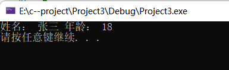
